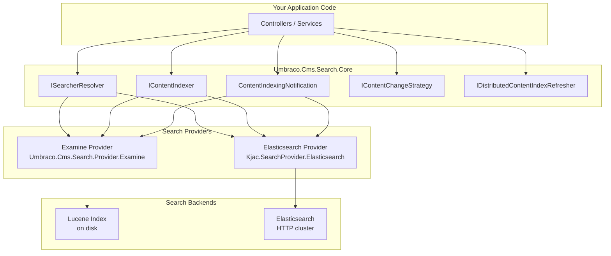
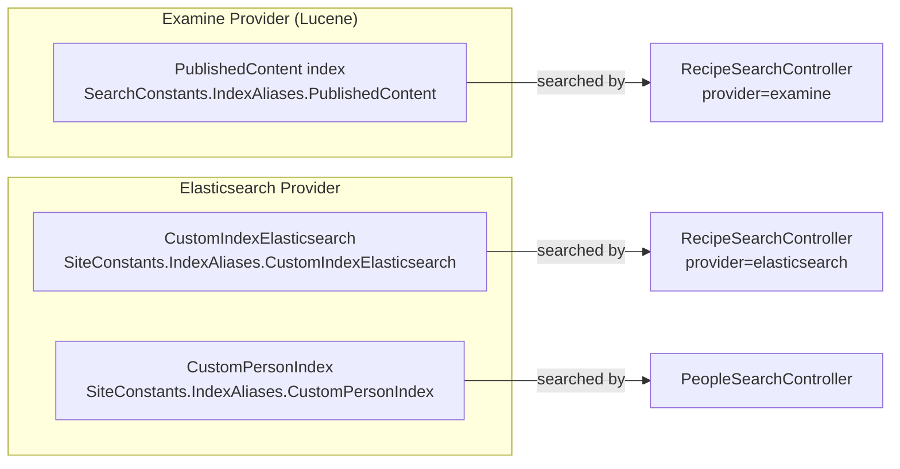
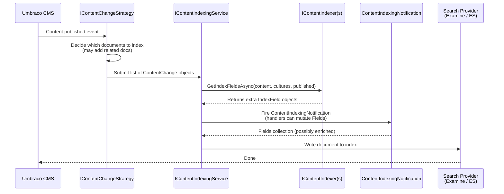
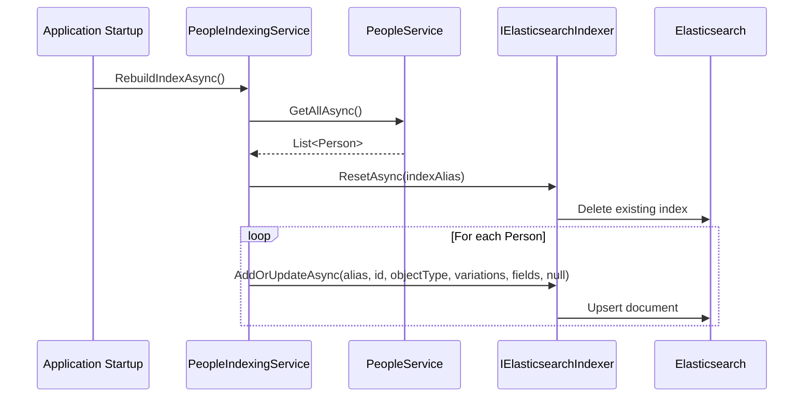
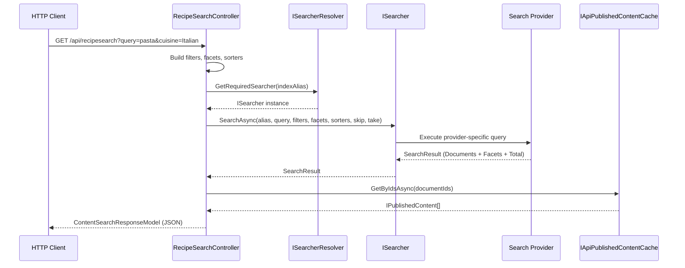
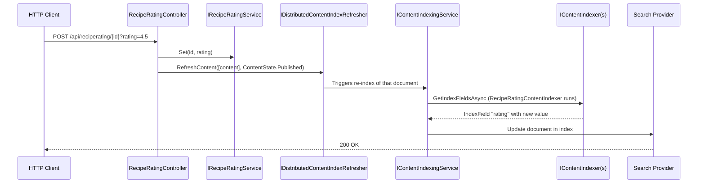
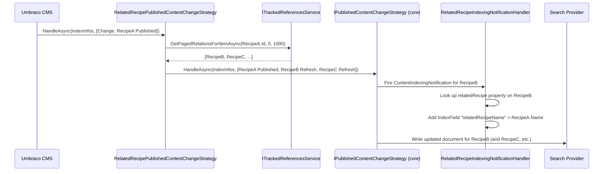
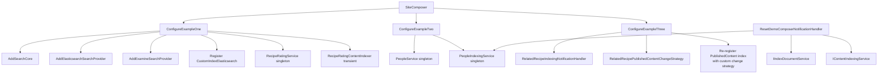

# Architecture Overview

This document shows how all the pieces of the new Umbraco Search API fit together, using Mermaid diagrams.

---

## The Big Picture: Layered Architecture

The new search system is built as a layered abstraction. Your application code only ever talks to the
**Core API** — it never touches Lucene or Elasticsearch directly.

The key insight is that **swapping providers** (e.g. from Examine to Elasticsearch) is a one-line change
in your DI registration. Your controllers, indexers, and notification handlers stay identical.

---

## Indexes: What Exists in This Demo

- **PublishedContent** — the default Umbraco content index, managed automatically by Umbraco. Uses Examine.
- **CustomIndexElasticsearch** — a second index for the same published content, but powered by Elasticsearch.
  Demonstrates that you can have multiple indexes for the same data with different providers.
- **CustomPersonIndex** — a completely custom index for non-Umbraco data (people from a JSON file). Elasticsearch only.

---

## Content Indexing Pipeline

When Umbraco content is published, a pipeline runs to update the search index. Here is how it flows:

Your two extension points in this pipeline are:

1. **`IContentIndexer`** — called synchronously during field assembly. Returns additional `IndexField` objects.
   Used in this demo to add the recipe `rating` field.

2. **`ContentIndexingNotification`** — fired just before the document is written. Handlers can add to
   `notification.Fields`. Used in this demo to add the `relatedRecipeName` field.

> See [docs/04-indexing-content.md](04-indexing-content.md) for full details on both approaches.

---

## Custom Data Indexing Pipeline (Non-Umbraco)

For data that has no connection to Umbraco content (like the people JSON file), you manage the full
lifecycle yourself:

> See [docs/05-custom-data-indexes.md](05-custom-data-indexes.md) for the full example.

---

## Search Request Flow

When a search request comes in from a client:

The two-phase pattern here is important:
1. **Search** returns only IDs and score data (fast)
2. **Content cache lookup** hydrates those IDs into rich content objects

This keeps the search index lean (no need to store all content fields) while still giving you access to
the full Umbraco content model for your response.

---

## Index Refresh Flow (Ratings Example)

When a recipe is rated, the index needs to be updated without waiting for the next publish:

> **Warning (from the code comment):** This triggers a reindex per rating. In production you should
> batch multiple ratings within a time window into a single indexing operation using a background thread
> with a timed delay. See [docs/09-real-time-updates.md](09-real-time-updates.md).

---

## Related Content Re-indexing Flow (Example 3)

When recipe A is published, any recipe B that _links to_ recipe A should also be re-indexed, so that
`relatedRecipeName` in recipe B's index document stays current:

> **Note (from the code comment):** The relation fetch is hardcoded to a maximum of 1,000 related
> documents. See [docs/06-content-change-strategies.md](06-content-change-strategies.md) for discussion.

---

## Component Dependency Map

---

## Continue Reading

- [Setup and Registration →](03-setup-and-registration.md)
- [Adding Custom Index Fields →](04-indexing-content.md)
