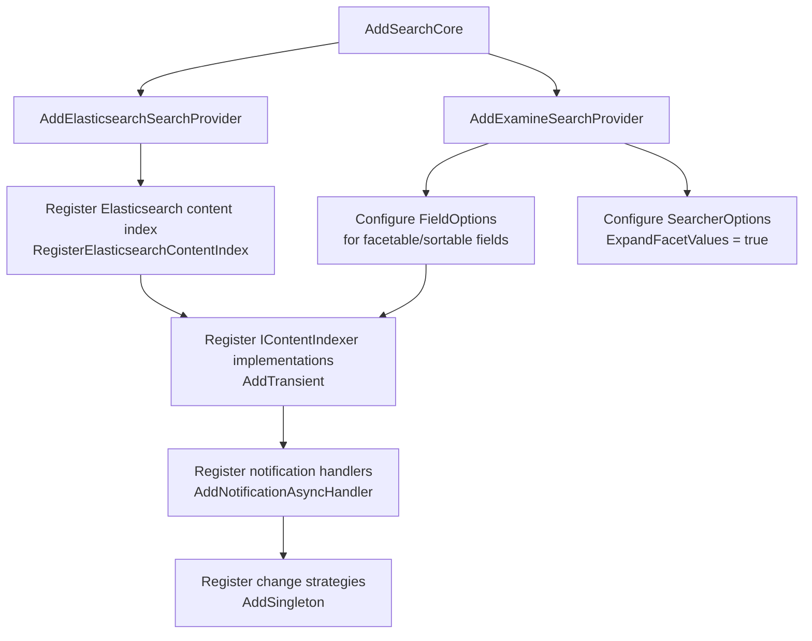

# Setup and Registration

This document covers installing the NuGet packages, registering search providers, configuring Elasticsearch,
and wiring everything together in a Composer.

---

## NuGet Packages

Add the following to your `.csproj`:

```xml
<!-- Core abstractions — always required -->
<PackageReference Include="Umbraco.Cms.Search.Core" Version="1.0.0-beta.2" />

<!-- Examine (Lucene) provider — for on-disk, no-infrastructure search -->
<PackageReference Include="Umbraco.Cms.Search.Provider.Examine" Version="1.0.0-beta.2" />

<!-- Optional: back-office UI for index management -->
<PackageReference Include="Umbraco.Cms.Search.BackOffice" Version="1.0.0-beta.2" />

<!-- Optional: community Elasticsearch provider -->
<PackageReference Include="Kjac.SearchProvider.Elasticsearch" Version="1.0.0-alpha.5" />
```

> **Note:** These packages are in beta/alpha at the time of this demo (Umbraco 17.2.0, .NET 10).
> Check NuGet for the latest stable versions.

---

## The Composer: Your Single Registration Point

Everything is wired up in a single `IComposer`. This project uses a partial class pattern to keep each
example in its own file, all called from one entry point:

```csharp
// src/DependencyInjection/SiteComposer.cs
public sealed class SiteComposer : IComposer
{
    public void Compose(IUmbracoBuilder builder)
        => builder
            .ConfigureExampleOne()   // Examine + Elasticsearch recipe search
            .ConfigureExampleTwo()   // custom people index
            .ConfigureExampleThree(); // related content re-indexing
}
```

Umbraco discovers `IComposer` implementations automatically via assembly scanning — you do not need to
register the composer itself anywhere.

---

## Registering the Core and Providers

`AddSearchCore()` must be called first. It registers the base services (`ISearcherResolver`,
`IContentIndexingService`, etc.). You then chain provider registrations onto the returned builder:

```csharp
// src/DependencyInjection/UmbracoBuilderExtensions.Example1.cs
builder
    .AddSearchCore()                    // required — registers core interfaces
    .AddElasticsearchSearchProvider()   // optional — adds Elasticsearch support
    .AddExamineSearchProvider();        // optional — adds Examine/Lucene support
```

You can register **both providers at the same time**. Each index is independently associated with a
specific provider when you register it (see the next section). This is how the demo lets you query
the same content via `?provider=examine` or `?provider=elasticsearch`.

---

## Registering an Index

Indexes are registered via `IndexOptions` in the DI container. The registration tells the system:
- What alias to use (the string key you use when searching)
- Which object type it covers (Documents, Members, etc.)
- Which provider handles it (Examine uses `IIndexer`/`ISearcher`; Elasticsearch has its own type)
- Optionally: a custom content change strategy

### Registering a content index for Elasticsearch

```csharp
// registers a published-content index using the Elasticsearch provider
builder.Services.Configure<IndexOptions>(options =>
    options.RegisterElasticsearchContentIndex<IPublishedContentChangeStrategy>(
        SiteConstants.IndexAliases.CustomIndexElasticsearch,  // "CustomIndexElasticsearch"
        UmbracoObjectTypes.Document
    )
);
```

### Registering the default published content index with a custom change strategy

```csharp
// re-registers the built-in PublishedContent index, overriding the change strategy
builder.Services.Configure<IndexOptions>(options =>
    options.RegisterContentIndex<IIndexer, ISearcher, RelatedRecipePublishedContentChangeStrategy>(
        SearchConstants.IndexAliases.PublishedContent,    // "PublishedContent"
        UmbracoObjectTypes.Document
    )
);

// also register the concrete strategy class itself
builder.Services.AddSingleton<RelatedRecipePublishedContentChangeStrategy>();
```

> When you re-register an index alias that already exists, the new registration replaces the old one.
> This is how Example 3 overrides the default `PublishedContent` index with its custom strategy.

---

## Registering Custom Indexers and Services

Custom `IContentIndexer` implementations are registered as **transient** services:

```csharp
builder.Services
    .AddSingleton<IRecipeRatingService, RecipeRatingService>()
    .AddTransient<IContentIndexer, RecipeRatingContentIndexer>();
```

Multiple `IContentIndexer` implementations can be registered simultaneously — the indexing pipeline
calls all of them and merges the resulting fields.

---

## Examine-Specific Configuration

Examine requires **explicit field configuration** for any fields you want to facet or sort on.
If you forget this step, facets and sorting simply will not work with Examine — there is no error,
they just return empty results. This is covered in detail in
[docs/08-examine-gotchas.md](08-examine-gotchas.md).

```csharp
// configure the Examine search provider
builder.ConfigureExamineSearchProvider();

// ---- inside ConfigureExamineSearchProvider() ----

// ExpandFacetValues: when any facet value is active, Examine normally hides
// non-active values in that same facet group. Setting this to true includes them.
// NOTE: this incurs a performance penalty when querying.
builder.Services.Configure<SearcherOptions>(options => options.ExpandFacetValues = true);

// declare fields for faceting and sorting
builder.Services.Configure<FieldOptions>(options => options.Fields =
[
    new() { PropertyName = "cuisine",         FieldValues = FieldValues.Keywords,  Facetable = true,  Sortable = true  },
    new() { PropertyName = "mealType",        FieldValues = FieldValues.Keywords,  Facetable = true,  Sortable = false },
    new() { PropertyName = "preparationTime", FieldValues = FieldValues.Integers,  Facetable = true,  Sortable = true  },
    new() { PropertyName = "rating",          FieldValues = FieldValues.Decimals,  Facetable = false, Sortable = true  },
]);
```

Elasticsearch does **not** need this — it infers field types from the data.

---

## Elasticsearch Configuration

Elasticsearch connection settings live in `appsettings.json`:

```json
"ElasticsearchSearchProvider": {
  "Client": {
    "Host": "http://localhost:9200",
    "Authentication": {
      "Username": "[your user name]",
      "Password": "[your password]"
    },
    "EnableDebugMode": false
  }
}
```

Set `EnableDebugMode: true` in `appsettings.Development.json` to log full Elasticsearch request/response
payloads — invaluable when debugging index mappings or query shapes.

> The community package (`Kjac.SearchProvider.Elasticsearch`) handles the mapping of these settings to the
> Elastic client. See its README for full configuration options:
> https://github.com/kjac/Kjac.SearchProvider.Elasticsearch

---

## The Reset-on-Startup Handler

The demo registers a startup handler that clears and rebuilds the published content indexes every time
the application boots. This is needed because the in-memory rating service is not persistent:

```csharp
// src/DependencyInjection/ResetDemoComposer.cs
public class ResetDemoComposer : IComposer
{
    public void Compose(IUmbracoBuilder builder)
        => builder.AddNotificationAsyncHandler<UmbracoApplicationStartedNotification,
                                               ResetDemoComposerNotificationHandler>();
}
```

```csharp
// src/NotificationHandlers/ResetDemoComposerNotificationHandler.cs
public async Task HandleAsync(UmbracoApplicationStartedNotification notification, CancellationToken ct)
{
    // NOTE: All this might be handled a little more gracefully by Umbraco Search in the future.
    //       Be sure to check the docs.
    await _indexDocumentService.DeleteAllAsync();
    _contentIndexingService.Rebuild(Constants.IndexAliases.PublishedContent, _originProvider.GetCurrent());
    _contentIndexingService.Rebuild(SiteConstants.IndexAliases.CustomIndexElasticsearch, _originProvider.GetCurrent());
}
```

The comment in the source is important: **this manual rebuild approach is an acknowledged rough edge** in
the beta. Watch the official Umbraco Search documentation — a more graceful built-in mechanism may appear
in a future release.

For the people index, the rebuild call is commented out because the source data never changes:

```csharp
// Comment this in to ensure that the people index is populated. This is not necessary to call at
// every boot, since the demo does not alter the people index after boot.
// await RebuildPeopleIndexAsync();
```

In a real application, you would call the people index rebuild only when the underlying data changes
(e.g., after a data import), not on every startup.

---

## Registration Order Summary



---

## Continue Reading

- [Adding Custom Index Fields →](04-indexing-content.md)
- [Custom Data Indexes →](05-custom-data-indexes.md)
- [Examine-Specific Gotchas →](08-examine-gotchas.md)
