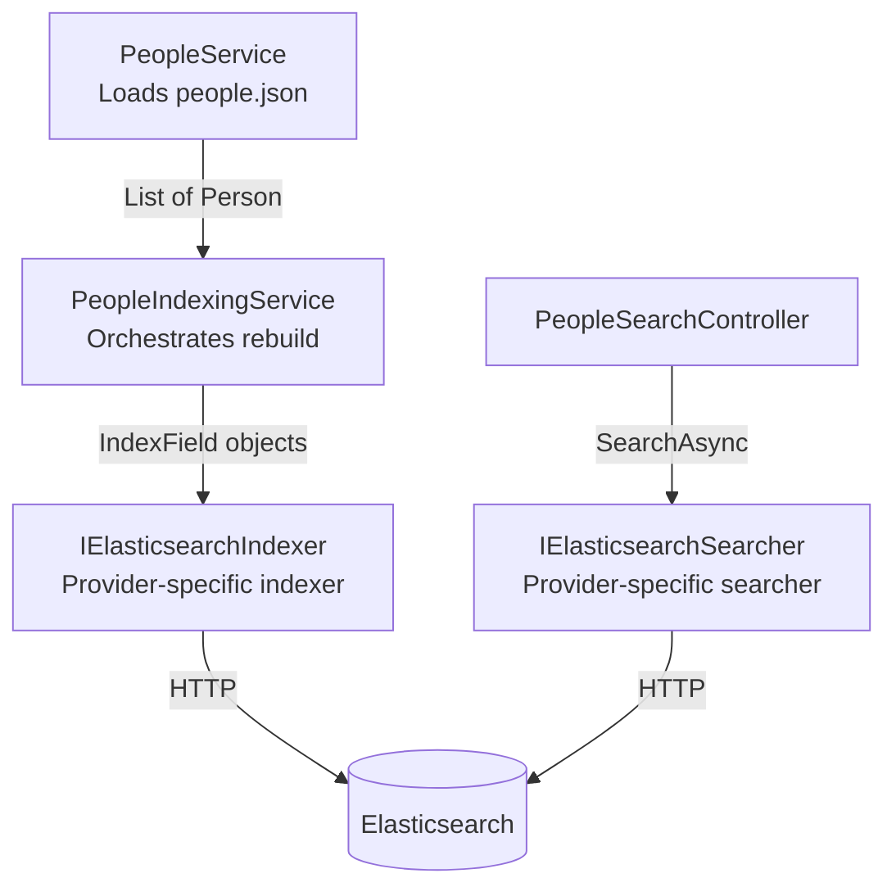
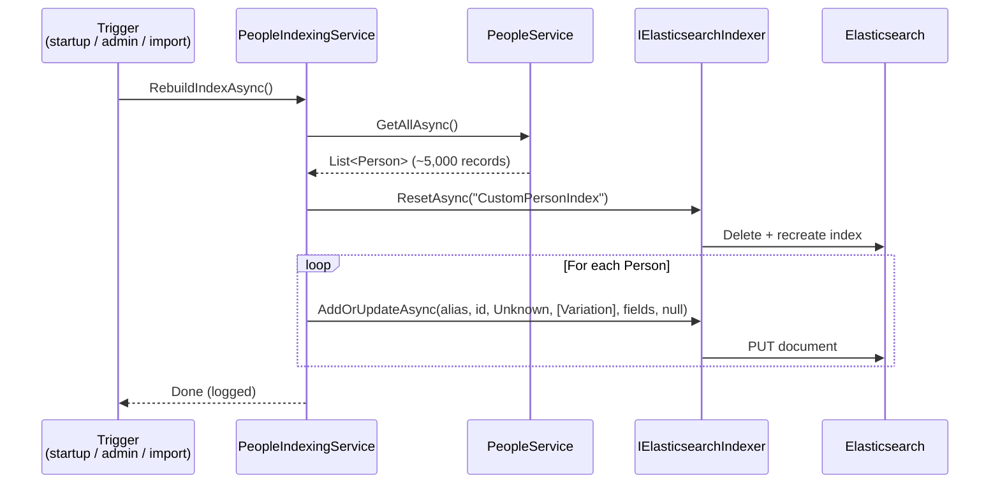

# Custom Data Indexes (Non-Umbraco Content)

One of the most powerful features of the new search API is the ability to index data that has **no
connection to Umbraco content** — your own database tables, external APIs, JSON files, whatever.

Example 2 in this demo indexes ~5,000 people loaded from `people.json`. There is no Umbraco content
involved at all. The index is managed entirely in code.

---

## When Would You Use This?

- Product catalogue from an external ERP system
- Staff directory from Active Directory / HR system
- Event listings from a third-party event platform
- Any dataset that needs powerful faceted search but lives outside Umbraco's content tree

---

## The Components Involved



---

## Step 1: Define Your Data Model

A plain C# class. No Umbraco dependencies required:

```csharp
// src/Models/Person.cs
public class Person
{
    public Guid Id { get; set; }
    public string Name { get; set; } = string.Empty;
    public string Email { get; set; } = string.Empty;
    public DateTimeOffset Birthdate { get; set; }
    public string Zodiac { get; set; } = string.Empty;
    public string Genre { get; set; } = string.Empty;  // favourite music genre
}
```

---

## Step 2: Define Your Field Names (Constants)

Use constants to avoid magic strings:

```csharp
// src/SiteConstants.cs
public static class SiteConstants
{
    public static class FieldNames
    {
        public const string Zodiac    = "zodiac";
        public const string Genre     = "genre";
        public const string Birthdate = "birthdate";
        public const string Name      = "name";
    }

    public static class IndexAliases
    {
        public const string CustomPersonIndex = "CustomPersonIndex";
    }
}
```

---

## Step 3: Build the IndexFields for Each Document

Each person maps to an array of `IndexField` objects. Here is the mapping from the indexing service:

```csharp
// src/Services/PeopleIndexingService.cs
private static IEnumerable<IndexField> GetIndexFields(Person person) =>
[
    new(
        SiteConstants.FieldNames.Zodiac,
        new IndexValue { Keywords = [person.Zodiac] },  // keyword only — for faceting
        Culture: null,
        Segment: null
    ),
    new(
        SiteConstants.FieldNames.Name,
        new IndexValue { Texts = [person.Name] },  // text only — for full-text search
        Culture: null,
        Segment: null
    ),
    new(
        SiteConstants.FieldNames.Birthdate,
        new IndexValue { DateTimeOffsets = [person.Birthdate] },  // date — for range facets
        Culture: null,
        Segment: null
    ),
    new(
        SiteConstants.FieldNames.Genre,
        new IndexValue
        {
            Keywords = [person.Genre],  // keyword — for exact-match faceting
            Texts    = [person.Genre],  // text — for full-text search
        },
        Culture: null,
        Segment: null
    ),
];
```

### Why genre has both Keywords and Texts

The `genre` field is configured with **both** value types so it can serve two purposes:
- As `Keywords`: enables exact-match filtering and faceting (`genre == "Jazz"`)
- As `Texts`: enables full-text search so a query for "jaz" still matches "Jazz" via stemming

There is also a helper extension method that does the same thing:

```csharp
// src/Extensions/PersonExtensions.cs
public static IEnumerable<IndexField> AsIndexFields(this Person person)
    => [ /* same mapping as above */ ];
```

This shows you can put the mapping logic on the model itself as an extension method — useful if you
want the data model and its search representation to travel together.

---

## Step 4: Write the Indexing Service

The indexing service orchestrates the full rebuild:

```csharp
// src/Services/PeopleIndexingService.cs
public class PeopleIndexingService : IPeopleIndexingService
{
    private readonly IElasticsearchIndexer _indexer;    // provider-specific indexer
    private readonly IPeopleService _peopleService;
    private readonly ILogger<PeopleIndexingService> _logger;

    public async Task RebuildIndexAsync()
    {
        _logger.LogInformation("Starting rebuild of index: {indexAlias}...", IndexAlias);

        var people = await _peopleService.GetAllAsync();

        // clear the existing index before rebuilding
        await _indexer.ResetAsync(IndexAlias);

        foreach (var person in people)
        {
            await _indexer.AddOrUpdateAsync(
                IndexAlias,
                person.Id,                          // the document ID (Guid)
                UmbracoObjectTypes.Unknown,         // use Unknown for non-Umbraco data
                [new Variation(null, null)],        // null culture + null segment = invariant
                GetIndexFields(person),
                null                                // no parent ID
            );
        }

        _logger.LogInformation("Finished rebuild of index: {indexAlias}", IndexAlias);
    }
}
```

### Key parameters in `AddOrUpdateAsync`

| Parameter | Value in demo | Notes |
|-----------|--------------|-------|
| `indexAlias` | `"CustomPersonIndex"` | Must match the alias used when searching |
| `id` | `person.Id` | Unique `Guid` — used for upserts |
| `objectType` | `UmbracoObjectTypes.Unknown` | Use `Unknown` for non-Umbraco data |
| `variations` | `[new Variation(null, null)]` | `null` culture + `null` segment = culture-invariant |
| `fields` | `GetIndexFields(person)` | The `IndexField` array |
| `parentId` | `null` | No parent for non-hierarchical data |

---

## Step 5: Register the Services

In the Composer, Example 2 is just two service registrations:

```csharp
// src/DependencyInjection/UmbracoBuilderExtensions.Example2.cs
builder.Services
    .AddSingleton<IPeopleService, PeopleService>()
    .AddSingleton<IPeopleIndexingService, PeopleIndexingService>();
```

Both are singletons because:
- `PeopleService` lazy-loads the JSON file once and caches it
- `PeopleIndexingService` is stateless and expensive to construct

---

## Step 6: Trigger the Rebuild

The rebuild is triggered from the startup notification handler:

```csharp
// src/NotificationHandlers/ResetDemoComposerNotificationHandler.cs
// Comment this in to ensure that the people index is populated. This is not necessary to call at
// every boot, since the demo does not alter the people index after boot.
// await RebuildPeopleIndexAsync();
```

The comment explains the decision: for data that only changes via an import, you do **not** want to
rebuild on every startup. Call it:
- After a data import or sync job
- Via an admin endpoint (e.g. a back-office dashboard action)
- On a scheduled task if data changes frequently

In production you would typically expose this via an admin-only API endpoint or a scheduled background
task, not a startup hook.

---

## The Full Rebuild Flow



---

## Note: `IElasticsearchIndexer` vs `IIndexer`

The demo uses `IElasticsearchIndexer` directly because the people index is **Elasticsearch-only**.
There is no Examine equivalent for a fully custom non-content index at this time.

If you want your custom index to be provider-agnostic in future, keep an eye on the `IIndexer` interface
from `Umbraco.Cms.Search.Core` — it is the provider-neutral abstraction that Examine and Elasticsearch
both implement for content indexes.

---

## Continue Reading

- [Content Change Strategies →](06-content-change-strategies.md)
- [Searching: Filters, Facets, Sorters →](07-searching.md)
