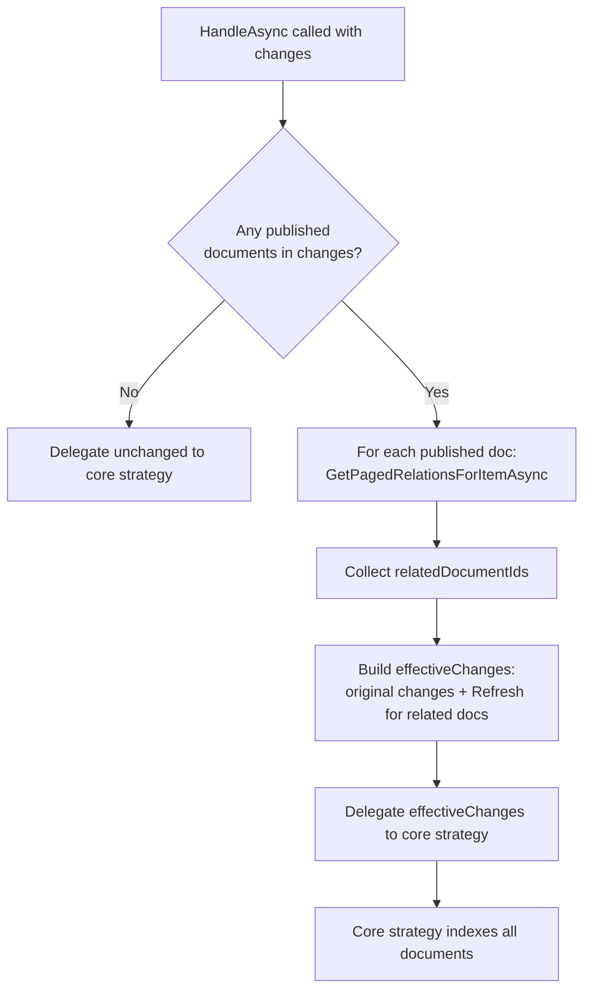

# Content Change Strategies

A **content change strategy** controls _which_ documents get re-indexed when a content change event
occurs. The default strategy re-indexes only the document that was directly published. A custom strategy
lets you expand that — for example, to also re-index related documents.

---

## The Default Behaviour

When you publish a recipe, Umbraco fires a publish event. The default `IPublishedContentChangeStrategy`
translates that into a `ContentChange` for that one recipe and triggers its re-index. Nothing else
is touched.

That is fine until you have **denormalized data** in your index. In this demo, the `PublishedContent`
index stores a field called `relatedRecipeName` on each recipe — the name of another recipe it links to.

The problem: if you rename **Recipe A**, and **Recipe B** links to it, Recipe B's indexed
`relatedRecipeName` is now stale. Recipe B was not published, so the default strategy never re-indexes it.

---

## `IContentChangeStrategy`

The interface you implement:

```csharp
public interface IContentChangeStrategy
{
    Task HandleAsync(
        IEnumerable<ContentIndexInfo> indexInfos,
        IEnumerable<ContentChange> changes,
        CancellationToken cancellationToken);

    Task RebuildAsync(
        ContentIndexInfo indexInfo,
        CancellationToken cancellationToken);
}
```

- `HandleAsync` — called on every content change event. `changes` contains the raw list of what happened.
  You can inspect it, expand it, and delegate to the core strategy.
- `RebuildAsync` — called when a full index rebuild is triggered. Almost always you just delegate this.

---

## The Demo Implementation: `RelatedRecipePublishedContentChangeStrategy`

```csharp
// src/ContentIndexing/RelatedRecipePublishedContentChangeStrategy.cs
public class RelatedRecipePublishedContentChangeStrategy : IContentChangeStrategy
{
    private readonly IPublishedContentChangeStrategy _publishedContentChangeStrategy;
    private readonly ITrackedReferencesService _trackedReferencesService;

    public async Task HandleAsync(
        IEnumerable<ContentIndexInfo> indexInfos,
        IEnumerable<ContentChange> changes,
        CancellationToken cancellationToken)
    {
        var contentChangesAsArray = changes as ContentChange[] ?? changes.ToArray();

        // find all published document IDs in this batch of changes
        var documentIds = contentChangesAsArray
            .Where(c => c.ObjectType is UmbracoObjectTypes.Document
                        && c.ContentState is ContentState.Published)
            .Select(c => c.Id)
            .ToArray();

        // for each published document, look up what other documents reference it
        var relatedDocumentIds = new List<Guid>();
        foreach (var documentId in documentIds)
        {
            // get all relations for the document
            // NOTE: for simplicity, just fetch the first 1000 relations here
            var references = await _trackedReferencesService.GetPagedRelationsForItemAsync(
                documentId,
                UmbracoObjectTypes.Document,
                0,
                1000,   // ← hardcoded limit — see warning below
                true);

            if (references.Success)
            {
                relatedDocumentIds.AddRange(
                    references.Result.Items.Select(item => item.NodeKey));
            }
        }

        // merge: original changes + Refresh changes for related docs (deduped)
        var effectiveChanges = contentChangesAsArray
            .Union(relatedDocumentIds
                .Except(documentIds)  // don't double-index the originals
                .Select(documentId =>
                    ContentChange.Document(documentId, ChangeImpact.Refresh, ContentState.Published))
            );

        // delegate the full effective set to the core strategy
        await _publishedContentChangeStrategy.HandleAsync(indexInfos, effectiveChanges, cancellationToken);
    }

    public async Task RebuildAsync(ContentIndexInfo indexInfo, CancellationToken cancellationToken)
        // just delegate this entirely to the core change strategy
        => await _publishedContentChangeStrategy.RebuildAsync(indexInfo, cancellationToken);
}
```

### What this does, step by step



---

## The 1,000 Relations Hardcoded Limit

The code comment says it clearly:

> **NOTE: for simplicity, just fetch the first 1000 relations here**

```csharp
var references = await _trackedReferencesService.GetPagedRelationsForItemAsync(
    documentId,
    UmbracoObjectTypes.Document,
    0,
    1000,  // ← this is a page size, not a total limit
    true);
```

`GetPagedRelationsForItemAsync` is paged. In this demo it only fetches page 0 (the first 1,000).
If a document has more than 1,000 other documents referencing it, the remainder will **not** be
re-indexed automatically.

**In production**, if you can have more than 1,000 relations, you should loop through all pages:

```csharp
// production-grade approach (not in the demo — illustrative only)
const int pageSize = 1000;
var skip = 0;
var allRelatedIds = new List<Guid>();
while (true)
{
    var page = await _trackedReferencesService.GetPagedRelationsForItemAsync(
        documentId, UmbracoObjectTypes.Document, skip, pageSize, true);

    if (!page.Success || !page.Result.Items.Any()) break;

    allRelatedIds.AddRange(page.Result.Items.Select(i => i.NodeKey));
    skip += pageSize;

    if (skip >= page.Result.Total) break;
}
```

---

## Registering the Custom Change Strategy

```csharp
// src/DependencyInjection/UmbracoBuilderExtensions.Example3.cs

// re-register the default published content index to use the custom change strategy
builder.Services.Configure<IndexOptions>(options =>
    options.RegisterContentIndex<IIndexer, ISearcher, RelatedRecipePublishedContentChangeStrategy>(
        SearchConstants.IndexAliases.PublishedContent,
        UmbracoObjectTypes.Document
    )
);

// also register the concrete strategy class itself — the comment reminds you not to forget this
builder.Services.AddSingleton<RelatedRecipePublishedContentChangeStrategy>();
```

> **Easy to miss:** You need both calls. The `RegisterContentIndex` call tells the options system to
> use your type as the strategy. The `AddSingleton` call registers the concrete implementation in the
> DI container so it can be resolved. If you forget the singleton, you will get a runtime DI exception.

---

## `ContentChange` Object

When you build extra changes to inject, you use the `ContentChange` factory methods:

```csharp
// a Refresh change — re-index the document with its current published state
ContentChange.Document(documentId, ChangeImpact.Refresh, ContentState.Published);
```

`ChangeImpact` values:
- `Refresh` — re-index the document (most common)
- `Remove` — remove the document from the index

`ContentState` values:
- `Published` — the published version of the content
- `Draft` — the unpublished draft (typically not indexed)

---

## When Do You Need a Custom Strategy?

| Scenario | Do you need a custom strategy? |
|----------|-----------------------------|
| Custom fields on the same document | No — use `IContentIndexer` or `ContentIndexingNotification` |
| Re-indexing related/linked documents | **Yes** |
| Re-indexing ancestor/descendant documents | **Yes** |
| Re-indexing documents in a different tree | **Yes** |
| Excluding certain documents from being indexed | **Yes** (filter from `changes` before delegating) |

---

## Continue Reading

- [Searching: Filters, Facets, Sorters →](07-searching.md)
- [Real-time Index Updates →](09-real-time-updates.md)
