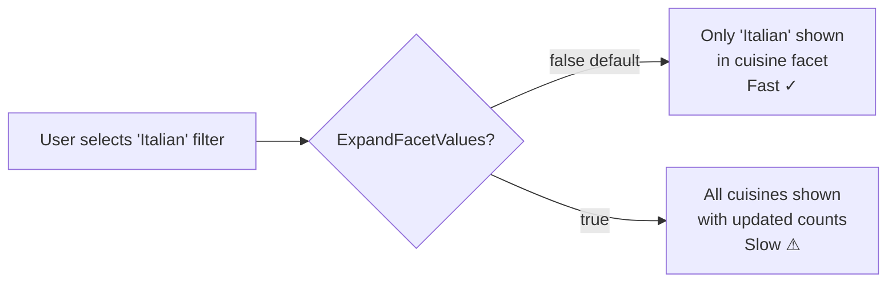

# Examine-Specific Gotchas

If you are using the Examine (Lucene) provider, there are two important configuration steps that are
**not required for Elasticsearch** but are **silently broken without them** for Examine. The source
code comments call these out explicitly.

---

## Gotcha 1: You Must Declare Fields for Faceting and Sorting

Elasticsearch infers field types from the data. Examine does not — it needs explicit declarations.

The comment in the source says it all:

> **"the Examine search provider requires explicit definitions of the fields used for faceting and/or sorting"**

Without `FieldOptions` configuration, querying for facets or sorting on custom fields with Examine will
return **empty facet results** and **fall back to relevance ordering** — silently, with no error.

### How to declare fields

```csharp
// src/DependencyInjection/UmbracoBuilderExtensions.Example1.cs
builder.Services.Configure<FieldOptions>(options => options.Fields =
[
    new()
    {
        PropertyName = "cuisine",
        FieldValues  = FieldValues.Keywords,
        Facetable    = true,
        Sortable     = true
    },
    new()
    {
        PropertyName = "mealType",
        FieldValues  = FieldValues.Keywords,
        Facetable    = true,
        Sortable     = false   // mealType is faceted but not sorted
    },
    new()
    {
        PropertyName = "preparationTime",
        FieldValues  = FieldValues.Integers,
        Facetable    = true,
        Sortable     = true
    },
    new()
    {
        PropertyName = "rating",
        FieldValues  = FieldValues.Decimals,
        Facetable    = false,  // rating is sorted but not faceted
        Sortable     = true
    },
]);
```

### The `FieldValues` enum

| Value | Maps to | Use for |
|-------|---------|---------|
| `FieldValues.Keywords` | Exact-match string | Text that should be filtered/faceted exactly: cuisine, mealType |
| `FieldValues.Texts` | Analysed full-text | Searchable prose — note: not sortable in Lucene |
| `FieldValues.Integers` | Integer | Numeric values that need range filtering or sorting |
| `FieldValues.Decimals` | Double | Decimal values (ratings, prices) |
| `FieldValues.DateTimeOffsets` | DateTime ticks | Dates that need range filtering or sorting |
| `FieldValues.Booleans` | Boolean | True/false flags |

### Checklist

For each custom field used in a search with Examine, ask:
- [ ] Is it used in a `KeywordFacet`? → `FieldValues.Keywords`, `Facetable = true`
- [ ] Is it used in an `IntegerRangeFacet`? → `FieldValues.Integers`, `Facetable = true`
- [ ] Is it used in a `DateTimeOffsetRangeFacet`? → `FieldValues.DateTimeOffsets`, `Facetable = true`
- [ ] Is it used in a `KeywordSorter`? → `FieldValues.Keywords`, `Sortable = true`
- [ ] Is it used in an `IntegerSorter`? → `FieldValues.Integers`, `Sortable = true`
- [ ] Is it used in a `DecimalSorter`? → `FieldValues.Decimals`, `Sortable = true`
- [ ] Is it used in a `DateTimeOffsetSorter`? → `FieldValues.DateTimeOffsets`, `Sortable = true`

> **You do not need to declare fields that are only used for filtering** (e.g. `KeywordFilter`).
> Filtering works on keyword fields without explicit declaration. Only faceting and sorting need it.

---

## Gotcha 2: `ExpandFacetValues` — Performance Warning

This is the most important warning in the codebase. The comment says:

> **"NOTE: this incurs a performance penalty when querying"**

```csharp
// src/DependencyInjection/UmbracoBuilderExtensions.Example1.cs
builder.Services.Configure<SearcherOptions>(options => options.ExpandFacetValues = true);
```

### What `ExpandFacetValues` does

By default in Examine (Lucene), facet behaviour is as follows:

- If **no** facet value is active (selected) in a facet group, all values are shown with their counts.
- If **any** facet value is active in a facet group (e.g., user selects "Italian"), only the active
  values are shown in that group. Non-active values disappear.

This is the standard Lucene faceting behaviour and is efficient because it only counts what is needed.

Setting `ExpandFacetValues = true` changes this:

- Even when a value is active in a facet group, **all valid (non-zero) values** are still shown.

This is usually what users expect — they pick "Italian" and still see the other cuisine options so they
can switch. But Lucene has to do extra work to compute it.

### The performance trade-off



In practice the penalty scales with:
- The number of facet groups
- The cardinality (number of unique values) in each group
- The total document count in the index

For small indexes (hundreds of documents, few facet fields) the penalty is negligible. For large
production indexes, benchmark before enabling this globally.

### Elasticsearch does not have this limitation

Elasticsearch computes all facet values efficiently regardless of active filters. The `ExpandFacetValues`
option is Examine-specific and has no effect when using the Elasticsearch provider.

---

## Gotcha 3: `FieldOptions` Applies Globally

`FieldOptions` is a global singleton configuration — all Examine-backed indexes share it. If you have
multiple indexes with different field shapes, you need to declare _all_ custom fields from _all_ indexes
in one place. There is currently no per-index `FieldOptions`.

This means if you have a recipe index with `cuisine` and a products index with `category`, both need
to appear in the same `FieldOptions.Fields` array.

---

## Gotcha 4: Field Declarations Must Match `IndexField` Value Types

If you declare a field as `FieldValues.Keywords` but write it with `new IndexValue { Texts = [...] }`,
Examine will treat it as an analysed text field internally but try to use it as a keyword for faceting
— the results will be wrong or empty.

Always match:

| `FieldOptions.FieldValues` | `IndexValue` property to populate |
|---------------------------|-----------------------------------|
| `FieldValues.Keywords` | `Keywords = [...]` |
| `FieldValues.Texts` | `Texts = [...]` |
| `FieldValues.Integers` | `Integers = [...]` |
| `FieldValues.Decimals` | `Decimals = [...]` |
| `FieldValues.DateTimeOffsets` | `DateTimeOffsets = [...]` |

A single field can carry multiple value types (e.g., both `Keywords` and `Texts`). In that case, declare
it with the `FieldValues` type that matches your facet/sort need (usually `Keywords`) and add the `Texts`
for free-text searching.

---

## Summary

| Issue | Symptom | Fix |
|-------|---------|-----|
| Missing `FieldOptions` declaration | Facets return empty, sorting ignored | Add field to `FieldOptions.Fields` with correct `FieldValues` type |
| Wrong `FieldValues` type | Incorrect facet counts, sort not working | Match `FieldValues` to your `IndexValue` type and usage |
| `ExpandFacetValues = false` (default) | Active facet group collapses to active values only | Set `ExpandFacetValues = true` — but budget for the performance cost |
| `ExpandFacetValues = true` on large index | Slow search responses | Benchmark; consider disabling for high-traffic indexes |

---

## Continue Reading

- [Real-time Index Updates →](09-real-time-updates.md)
- [Searching →](07-searching.md)
