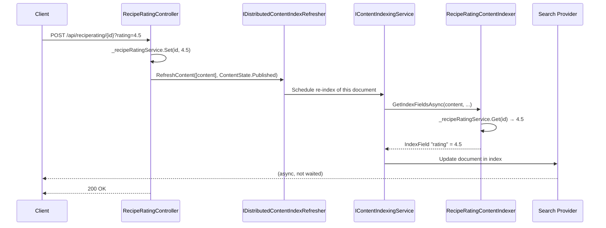

# Real-time Index Updates

Sometimes you need to update a document in the search index **without publishing content**. The typical
scenario: a value that feeds into the index is updated by an external process (a rating, a stock level,
a computed score) and you want search results to reflect it immediately.

---

## The Problem

Umbraco's normal content indexing only triggers when content is published. If your index includes
data from an external source (like the in-memory rating service in this demo), that data will be
stale until the next publish.

In the demo, every recipe starts with a default rating of 2.5. When a user rates a recipe via the
`RecipeRatingController`, the in-memory rating changes but the Lucene/Elasticsearch document still
holds 2.5 — until you explicitly trigger a reindex.

---

## `IDistributedContentIndexRefresher`

This interface triggers a re-index of specific content items without requiring a full publish:

```csharp
// src/Controllers/RecipeRatingController.cs
[HttpPost("{id:guid}")]
public IActionResult Rate(Guid id, double rating)
{
    var content = _contentService.GetById(id);
    if (content is not { Published: true, ContentType.Alias: "recipe" })
        return BadRequest();

    // update the in-memory rating
    _recipeRatingService.Set(id, rating);

    // trigger a reindex of the recipe to update the rating
    // NOTE: this should really be handled with a timed delay on a background thread, to handle
    //       multiple ratings within a timeframe as a single indexing operation.
    _distributedContentIndexRefresher.RefreshContent([content], ContentState.Published);

    return Ok();
}
```

### What happens when you call `RefreshContent`



The refresh is **not awaited** in the controller. The 200 OK is returned immediately and the index
update happens asynchronously in the background. This is intentional — you do not want HTTP responses
to block on index writes.

---

## The Batching Warning

The code comment is explicit about a production concern:

> **"NOTE: this should really be handled with a timed delay on a background thread, to handle multiple
> ratings within a timeframe as a single indexing operation."**

### Why this matters

If 100 users rate the same recipe within 5 seconds, the current code triggers 100 separate reindex
operations. Each one:
1. Calls `RecipeRatingContentIndexer.GetIndexFieldsAsync`
2. Reassembles the full document
3. Writes to Lucene/Elasticsearch

This is wasteful and can cause index write contention. The correct approach is to **debounce** the
reindex calls — collect all the ratings within a time window, update the rating service once, and
fire a single reindex.

### Sketch of a batching approach

This is **not in the demo** — it is illustrative only:

```csharp
// Pseudocode sketch — not production code
public class DebouncedRecipeIndexRefresher
{
    private readonly ConcurrentDictionary<Guid, Timer> _pendingRefreshes = new();
    private readonly IDistributedContentIndexRefresher _refresher;
    private readonly IContentService _contentService;
    private const int DebounceMs = 5000; // wait 5 seconds after last rating

    public void ScheduleRefresh(Guid contentId)
    {
        // cancel any existing timer for this content ID
        if (_pendingRefreshes.TryRemove(contentId, out var existing))
            existing.Dispose();

        // start a new timer — fires once after debounce period
        var timer = new Timer(_ =>
        {
            _pendingRefreshes.TryRemove(contentId, out _);
            var content = _contentService.GetById(contentId);
            if (content != null)
                _refresher.RefreshContent([content], ContentState.Published);
        }, null, DebounceMs, Timeout.Infinite);

        _pendingRefreshes[contentId] = timer;
    }
}
```

The key insight: `RefreshContent` should be called once per content item per time window, not once
per user action.

---

## `RefreshContent` vs Full Rebuild

| Method | Scope | When to use |
|--------|-------|-------------|
| `RefreshContent([content], state)` | Single document | Rating changed, external data updated |
| `_contentIndexingService.Rebuild(alias, origin)` | Entire index | After data migration, after deployment, resetting demo |
| `_indexDocumentService.DeleteAllAsync()` | Clears document cache | Before a full rebuild (see startup handler) |

Use `RefreshContent` for targeted, per-document updates. Use `Rebuild` sparingly — it is expensive
and will cause the index to be temporarily incomplete while rebuilding.

---

## The Startup Rebuild Caveat

The demo rebuilds indexes on every startup via the `ResetDemoComposerNotificationHandler`. The source
code comment notes:

> **"NOTE: All this might be handled a little more gracefully by Umbraco Search in the future.
> Be sure to check the docs."**

The current pattern requires:
1. `DeleteAllAsync()` — clear the index document cache
2. `Rebuild(alias, origin)` — trigger a full rebuild of each index

This two-step is necessary because without clearing the cache first, the rebuild may not see the
latest data. It is a known rough edge in the beta API.

```csharp
// src/NotificationHandlers/ResetDemoComposerNotificationHandler.cs
private async Task RebuildPublishedContentIndexesAsync()
{
    // NOTE: All this might be handled a little more gracefully by Umbraco Search in the future.
    await _indexDocumentService.DeleteAllAsync();
    _contentIndexingService.Rebuild(Constants.IndexAliases.PublishedContent, _originProvider.GetCurrent());
    _contentIndexingService.Rebuild(SiteConstants.IndexAliases.CustomIndexElasticsearch, _originProvider.GetCurrent());
}
```

Watch the official Umbraco Search documentation for improvements here — there may be a cleaner
API in a future release.

---

## Distributed Refresh

The interface name `IDistributedContentIndexRefresher` is deliberate. In a multi-server Umbraco
deployment (load-balanced), this ensures that all server instances update their local indexes when
content changes — not just the server that processed the request.

This is the same mechanism Umbraco uses internally when you publish content in the back office.

---

## Summary

| Interface | Purpose | Async? |
|-----------|---------|--------|
| `IDistributedContentIndexRefresher.RefreshContent` | Re-index specific documents without publishing | Fire-and-forget |
| `IContentIndexingService.Rebuild` | Full index rebuild | Fire-and-forget |
| `IIndexDocumentService.DeleteAllAsync` | Clear index document cache | Awaitable |

---

## Further Reading

- [Architecture Overview →](02-architecture.md) (includes the full rating update sequence diagram)
- [Adding Custom Index Fields →](04-indexing-content.md) (what runs when the refresh fires)
- [Setup and Registration →](03-setup-and-registration.md) (the startup rebuild handler)
