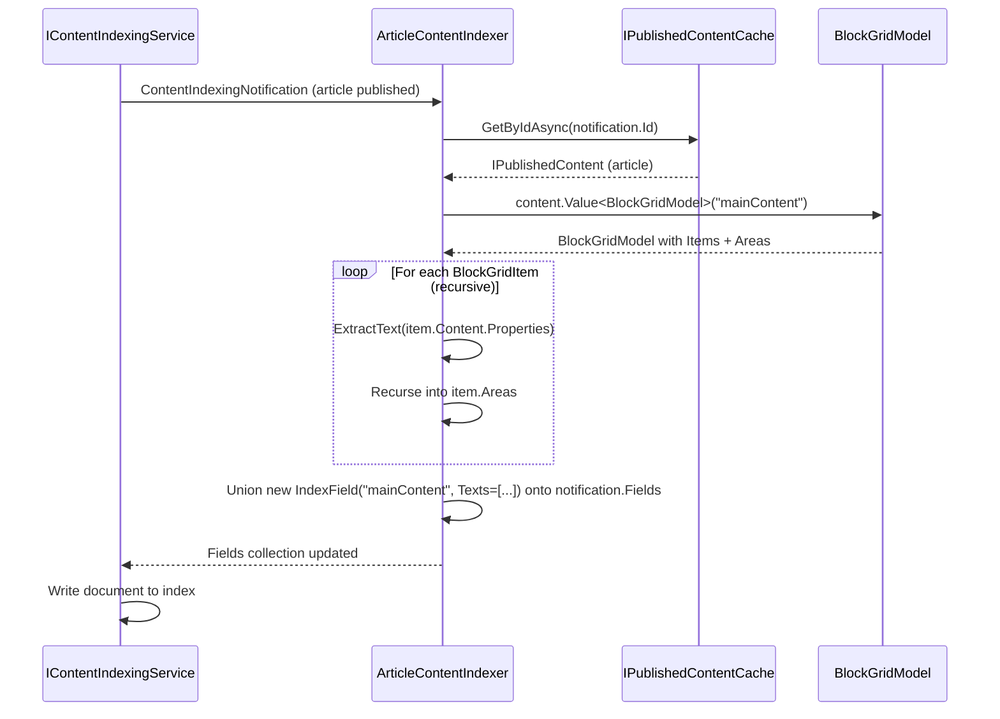

# Umbraco Search Q&A

A running record of questions and answers about the new Umbraco Search API (`Umbraco.Cms.Search`), introduced in Umbraco 17.

---

## What is `Umbraco.Cms.Search` and when was it introduced?

It is a provider-agnostic search abstraction layer introduced in **Umbraco 17**. It sits on top of whichever search backend you choose — Lucene (via Examine) or Elasticsearch — and exposes a single consistent API regardless of the underlying provider. The core package is `Umbraco.Cms.Search.Core` (1.0.0-beta.2 at the time of this demo).

---

## What NuGet packages do I need?

| Package | Purpose |
|---------|---------|
| `Umbraco.Cms.Search.Core` | Core abstractions — always required |
| `Umbraco.Cms.Search.Provider.Examine` | Lucene/Examine (on-disk) provider |
| `Umbraco.Cms.Search.BackOffice` | Replaces the back-office global search bar with the new Search API (optional) |
| `Kjac.SearchProvider.Elasticsearch` | Community Elasticsearch provider (optional) |

---

## What is the main advantage of the new API over classic Examine?

The key advantages are:

- **Provider abstraction** — swapping from Examine to Elasticsearch is a single line change in DI registration; your controllers and indexers stay identical.
- **Built-in faceting** — `KeywordFacet`, `IntegerRangeFacet`, and `DateTimeOffsetRangeFacet` are first-class concepts, not workarounds.
- **Typed filtering and sorting** — `KeywordFilter`, `IntegerRangeFilter`, `DecimalSorter`, etc. replace raw Lucene query strings.
- **Non-Umbraco data** — custom data (e.g. people from a JSON file) is a first-class use case via `IElasticsearchIndexer`.

---

## How do I register the search system in my Composer?

Call `AddSearchCore()` first, then chain on whichever providers you need:

```csharp
builder
    .AddSearchCore()
    .AddElasticsearchSearchProvider()   // optional
    .AddExamineSearchProvider();        // optional
```

Both providers can be registered simultaneously. Each index is independently associated with a specific provider at registration time.

---

## How do I register an index?

Use `IndexOptions` in DI. For an Elasticsearch content index:

```csharp
builder.Services.Configure<IndexOptions>(options =>
    options.RegisterElasticsearchContentIndex<IPublishedContentChangeStrategy>(
        "MyIndexAlias",
        UmbracoObjectTypes.Document
    )
);
```

For an Examine content index with a custom change strategy:

```csharp
builder.Services.Configure<IndexOptions>(options =>
    options.RegisterContentIndex<IIndexer, ISearcher, MyChangeStrategy>(
        SearchConstants.IndexAliases.PublishedContent,
        UmbracoObjectTypes.Document
    )
);
builder.Services.AddSingleton<MyChangeStrategy>();
```

> Re-registering an alias replaces the previous registration. You must also register the concrete strategy class separately in DI, or you will get a runtime exception.

---

## What are the two ways to add custom fields to a content index?

| Approach | Interface | When it fires | Best for |
|----------|-----------|---------------|----------|
| `IContentIndexer` | `IContentIndexer` | During field assembly | Service-injected, synchronous enrichment |
| Notification | `INotificationAsyncHandler<ContentIndexingNotification>` | Just before writing to the index | Async, access to published content model, cross-cutting |

Both can coexist. The pipeline runs all `IContentIndexer` implementations first, then fires the notification.

---

## How does `IContentIndexer` work?

Implement the interface and register it as **transient**. It receives the full `IContentBase` object:

```csharp
public class MyContentIndexer : IContentIndexer
{
    public Task<IEnumerable<IndexField>> GetIndexFieldsAsync(
        IContentBase content, string?[] cultures, bool published, CancellationToken ct)
    {
        if (content.ContentType.Alias is not "recipe")
            return Task.FromResult(Enumerable.Empty<IndexField>());

        return Task.FromResult<IEnumerable<IndexField>>([
            new IndexField("rating", new IndexValue { Decimals = [4.5m] }, null, null)
        ]);
    }
}
```

```csharp
builder.Services.AddTransient<IContentIndexer, MyContentIndexer>();
```

Multiple `IContentIndexer` implementations can be registered — all are called and their fields merged.

---

## What is the difference between `Keywords` and `Texts` in `IndexValue`?

| Type | Analysed? | Use for |
|------|-----------|---------|
| `Keywords` | No — stored as-is | Exact-match filtering, faceting, sorting |
| `Texts` | Yes — tokenised and stemmed | Full-text search |

A single field can carry **both**, which allows both exact-match faceting and full-text search on the same field. For example, `genre = "Jazz"` stored as both `Keywords` and `Texts` means a query for "jaz" still matches via stemming, and the facet can still group by the exact value "Jazz".

---

## How do I search an index?

Inject `ISearcherResolver`, get a searcher, and call `SearchAsync`:

```csharp
var searcher = _searcherResolver.GetRequiredSearcher(indexAlias);

var result = await searcher.SearchAsync(
    indexAlias: indexAlias,
    query:      "pasta",
    filters:    [new KeywordFilter("cuisine", ["Italian"], false)],
    facets:     [new KeywordFacet("cuisine"), new IntegerRangeFacet("preparationTime", ranges)],
    sorters:    [new DecimalSorter("rating", Direction.Descending)],
    skip:       0,
    take:       10
);
```

The result contains `result.Total`, `result.Documents` (with `.Id` per document), and `result.Facets`.

---

## What filter types are available?

| Filter class | Field type | Example |
|-------------|-----------|---------|
| `KeywordFilter` | Keywords | `cuisine == "Italian"` |
| `IntegerRangeFilter` | Integers | `preparationTime` between 15 and 30 |
| `DateTimeOffsetRangeFilter` | DateTimeOffsets | `birthdate` within a year range |

Multiple filters are combined with AND logic. Multiple values within a single filter use OR logic. The third constructor argument is a `negate` flag — set to `true` to exclude matching documents.

---

## What sorter types are available?

| Sorter class | Field type |
|-------------|-----------|
| `ScoreSorter` | Relevance score |
| `TextSorter` | Analysed text (alphabetical) |
| `KeywordSorter` | Exact keyword (alphabetical) |
| `IntegerSorter` | Integer |
| `DecimalSorter` | Decimal |
| `DateTimeOffsetSorter` | Date/time |

> For Examine, any field used for sorting must be declared in `FieldOptions` with `Sortable = true`, or Examine silently falls back to relevance ordering.

---

## What is the two-phase result pattern and why use it?

After searching, you get back only document IDs (not the full content). You then fetch full content from the Umbraco published content cache:

```csharp
// phase 1 — search
var result = await searcher.SearchAsync(/* ... */);
var ids = result.Documents.Select(d => d.Id);

// phase 2 — hydrate
var content = await _publishedContentCache.GetByIdsAsync(ids);
```

This keeps the search index lean — you only store fields needed for filtering, faceting, and sorting. Rich content (teaser text, URLs, images) is fetched from Umbraco's optimised cache.

> **Note:** `GetByIdsAsync` returns results in an unspecified order. If result ranking matters, re-sort the hydrated collection to match the original ID order from the search result.

---

## How do I index data that has no connection to Umbraco content?

Use `IElasticsearchIndexer` directly. Map your data model to `IndexField` arrays and call `AddOrUpdateAsync`:

```csharp
await _indexer.ResetAsync(indexAlias);  // clear existing index

await _indexer.AddOrUpdateAsync(
    indexAlias,
    person.Id,                       // Guid document ID
    UmbracoObjectTypes.Unknown,      // use Unknown for non-Umbraco data
    [new Variation(null, null)],     // culture-invariant
    GetIndexFields(person),          // your IndexField array
    null                             // no parent
);
```

There is no Examine equivalent for fully custom non-content indexes at this time — this is Elasticsearch-only.

---

## What is a content change strategy and when do I need one?

A content change strategy (`IContentChangeStrategy`) controls which documents get re-indexed when a content change event fires. The **default** strategy re-indexes only the document that was published.

You need a custom strategy when:
- You need to re-index **related or linked documents** (e.g. a document stores a denormalized field from another document)
- You need to re-index ancestor or descendant documents
- You want to **exclude** certain documents from indexing

You do **not** need a custom strategy just to add extra fields to the same document — use `IContentIndexer` or `ContentIndexingNotification` for that.

---

## How does the related recipe re-indexing strategy work?

When Recipe A is published, `RelatedRecipePublishedContentChangeStrategy`:

1. Finds all documents that reference Recipe A (via `ITrackedReferencesService.GetPagedRelationsForItemAsync`)
2. Adds `ContentChange.Document(id, ChangeImpact.Refresh, ContentState.Published)` entries for each related document
3. Delegates the merged set of changes to the core `IPublishedContentChangeStrategy`

This ensures that Recipe B's index entry (which contains Recipe A's name as `relatedRecipeName`) is refreshed automatically when Recipe A is renamed.

> The demo hardcodes a limit of 1,000 relations per page. In production, loop through all pages if you could have more than 1,000 references to a single document.

---

## How do I update the index without publishing content?

Use `IDistributedContentIndexRefresher.RefreshContent`:

```csharp
_distributedContentIndexRefresher.RefreshContent([content], ContentState.Published);
```

This triggers a re-index of the specified documents without a publish event. The call is fire-and-forget — the HTTP response is returned immediately and the index update happens asynchronously.

> In production, avoid calling this once per user action if many actions can happen in a short window. Use a debounce/batching pattern to coalesce multiple updates into a single reindex per time window.

---

## What are the Examine-specific gotchas I need to know about?

**1. Declare fields for faceting and sorting**

Elasticsearch infers field types; Examine does not. Without explicit `FieldOptions` configuration, facets return empty results and sorting silently falls back to relevance. You do **not** need to declare fields used only for filtering.

```csharp
builder.Services.Configure<FieldOptions>(options => options.Fields =
[
    new() { PropertyName = "cuisine", FieldValues = FieldValues.Keywords, Facetable = true, Sortable = true },
    new() { PropertyName = "rating",  FieldValues = FieldValues.Decimals,  Facetable = false, Sortable = true },
]);
```

**2. `ExpandFacetValues` has a performance cost**

By default in Examine, selecting a facet value collapses the facet group to show only the active value. Setting `ExpandFacetValues = true` shows all values even when one is active — which is usually what users expect — but incurs a performance penalty. Benchmark on large indexes before enabling globally.

**3. `FieldOptions` is global**

There is no per-index `FieldOptions`. All Examine-backed indexes share one configuration — declare all custom fields from all indexes in the same array.

**4. `FieldValues` must match `IndexValue` types**

If you declare a field as `FieldValues.Keywords` but write it with `IndexValue { Texts = [...] }`, facet and sort results will be wrong or empty. Always match the declaration to the value type you actually write.

---

## How do I index a Block Grid property (e.g. `mainContent` on an article document type)?

> **Short answer: you don't need to.** The new search API indexes Block Grid properties automatically via the built-in `BlockGridPropertyValueHandler`. It recursively processes all nested block properties, accumulates their text, keyword, numeric, and date values, and strips HTML from any rich text blocks. The field appears in the index under the property alias (e.g. `mainContent`).

A custom indexer is only needed if you want to **change what gets indexed** — for example, indexing only specific block types, adding computed values, or transforming the content in some way.

---

### If you do need a custom Block Grid indexer

Block Grid values need to be read from the **published content model** (`IPublishedContent`) to be parsed into a `BlockGridModel`. That means the `ContentIndexingNotification` approach is the right choice — `IContentIndexer` only gives you `IContentBase`, which holds the raw unpublished property value as JSON rather than a usable model.

### The approach



1. Handle `ContentIndexingNotification`
2. Fetch the published content via `IPublishedContentCache`
3. Read the property as `BlockGridModel`
4. Walk all blocks (and their areas) recursively to extract text
5. Write the combined text as a `Texts` field so it is full-text searchable

### Example implementation

```csharp
public class ArticleContentIndexer : INotificationAsyncHandler<ContentIndexingNotification>
{
    private readonly IPublishedContentCache _publishedContentCache;

    public ArticleContentIndexer(IPublishedContentCache publishedContentCache)
        => _publishedContentCache = publishedContentCache;

    public async Task HandleAsync(ContentIndexingNotification notification, CancellationToken ct)
    {
        // only handle the relevant index(es)
        if (notification.IndexAlias is not SearchConstants.IndexAliases.PublishedContent)
            return;

        var content = await _publishedContentCache.GetByIdAsync(notification.Id);
        if (content?.ContentType.Alias != "article")
            return;

        var blockGrid = content.Value<BlockGridModel>("mainContent");
        if (blockGrid is null)
            return;

        var texts = ExtractText(blockGrid.Items).ToArray();
        if (texts.Length == 0)
            return;

        notification.Fields = notification.Fields
            .Union([
                new IndexField(
                    FieldName: "mainContent",
                    Value: new IndexValue { Texts = texts },
                    Culture: null,
                    Segment: null
                )
            ])
            .ToArray();
    }

    private static IEnumerable<string> ExtractText(IEnumerable<BlockGridItem> items)
    {
        foreach (var item in items)
        {
            // extract text from each property on the block's content element
            foreach (var property in item.Content.Properties)
            {
                var value = item.Content.Value<string>(property.Alias);
                if (!string.IsNullOrWhiteSpace(value))
                    yield return value;
            }

            // recurse into grid areas (columns / zones)
            foreach (var area in item.Areas)
            foreach (var text in ExtractText(area.Items))
                yield return text;
        }
    }
}
```

### Registration

```csharp
builder.AddNotificationAsyncHandler<ContentIndexingNotification, ArticleContentIndexer>();
```

### Things to watch out for

**Rich text blocks produce HTML.** If any of your blocks contain a Rich Text Editor property, `Value<string>()` will return raw HTML including tags like `<p>`, `<strong>`, etc. Strip the HTML before indexing so tags don't pollute search results:

```csharp
var value = item.Content.Value<string>(property.Alias);
if (!string.IsNullOrWhiteSpace(value))
{
    var text = Regex.Replace(value, "<[^>]+>", " ").Trim();
    if (!string.IsNullOrWhiteSpace(text))
        yield return text;
}
```

**Not all properties are text.** Iterating over every property and calling `Value<string>()` will return `null` for non-text properties (media pickers, content pickers, checkboxes, etc.) — safely skipped by the `IsNullOrWhiteSpace` guard. If you want to be more selective, guard on `item.Content.ContentType.Alias` or `property.Alias`.

**Culture-variant content.** If your site is multilingual, loop over the cultures provided by the notification and create a separate `IndexField` per culture, passing the culture string instead of `null` for the `Culture` parameter.

---

## What indexes does the Examine provider register, and what fields do they contain by default?

### The four indexes

Calling `AddExamineSearchProvider()` registers four Lucene indexes:

| Alias constant | Actual alias string | Object type | Change strategy |
|---|---|---|---|
| `Constants.IndexAliases.DraftContent` | `Umb_Content` | Document | `IDraftContentChangeStrategy` |
| `Constants.IndexAliases.PublishedContent` | `Umb_PublishedContent` | Document | `IPublishedContentChangeStrategy` |
| `Constants.IndexAliases.DraftMedia` | `Umb_Media` | Media | `IDraftContentChangeStrategy` |
| `Constants.IndexAliases.DraftMembers` | `Umb_Members` | Member | `IDraftContentChangeStrategy` |

> Note: these alias strings are different from classic Examine (`InternalIndex`, `ExternalIndex`, etc.). Any code that hard-codes the old names will break.

---

### System fields (every document gets these)

The internal `SystemFieldsContentIndexer` writes the following fields on every indexed item. All field names are defined in `Constants.FieldNames` and are prefixed `Umb_`:

| Field name | Type | Contains |
|---|---|---|
| `Umb_Id` | Keyword | The content `Key` (Guid) |
| `Umb_ParentId` | Keyword | Parent `Key` (Guid); `Guid.Empty` for root items; recycle bin key if trashed |
| `Umb_PathIds` | Keywords (multi-value) | All ancestor keys + the item's own key — the full path as Guids |
| `Umb_ContentTypeId` | Keyword | The content type's `Key` (Guid) |
| `Umb_CreateDate` | DateTimeOffset | Creation date |
| `Umb_UpdateDate` | DateTimeOffset | Last updated date |
| `Umb_Level` | Integer | Depth in the content tree |
| `Umb_SortOrder` | Integer | Sort order among siblings |
| `Umb_ObjectType` | Keyword | `"Document"`, `"Media"`, or `"Member"` |
| `Umb_Name` | TextsR1 (per culture) | Content name — indexed as highest-rank full-text so it scores higher in relevance |
| `Umb_Tags` | Keywords (per culture) | Any Umbraco tags assigned to the item |

> **All IDs are stored as Guids (Keywords), not integers.** Classic Examine stored `parentID` as an integer. The new system uses Guid keys throughout, so filters on these fields must use Guid strings.

---

### Property value fields

The internal `PropertyValueFieldsContentIndexer` then iterates every property on the content item and adds its value using the matching `IPropertyValueHandler` for that property editor. The built-in handlers cover:

- Plain strings, keyword strings, rich text, markdown, labels
- Integers, decimals, booleans, date/times
- Block List, Block Grid, Block Editor
- Content picker, multi-node tree picker, multi-URL picker
- Tags

**Sensitive member properties are automatically excluded** — the indexer checks `IMemberType.IsSensitiveProperty()` and skips those fields entirely.

If no handler is registered for a property editor alias, a debug log message is written and the property is skipped silently.

---

### The `DisableDefaultExamineIndexes()` escape hatch

If the new search stack is powering everything (front-end search, back-office search, and the Delivery API), you can stop Umbraco maintaining its own legacy Examine indexes by calling:

```csharp
builder.DisableDefaultExamineIndexes();
```

This replaces `IExamineManager` with `MaskedCoreIndexesExamineManager`, which hides the old built-in indexes from Examine's index list. Only do this when you are certain nothing else depends on the classic indexes.

---

## How do you control the level of fuzzy search?

**Short answer: the new API does not expose fuzzy (edit-distance) search controls.** This is a genuine limitation of the current beta.

---

### What "fuzzy" means and what the new API actually does

True fuzzy search uses edit-distance (Levenshtein distance) — a query for "psata" still matches "pasta" because they are one character substitution apart. This is different from wildcard/prefix matching, which only catches suffixes.

Reading `Searcher.cs` directly, the free-text query for each space-separated term does exactly two things in Lucene:

```csharp
// 1. exact term match, with boost
.Field(Constants.SystemFields.AggregatedTextsR1, term.Boost(SearcherOptions.BoostFactorTextR1))

// 2. wildcard suffix match — term* — catches "pasta" when you type "past"
.Field(Constants.SystemFields.AggregatedTextsR1, term.MultipleCharacterWildcard())
```

`MultipleCharacterWildcard()` appends `*` to the term, so "past" matches "pasta", "pastry", "pastime" etc. That is the only "fuzzy-like" behaviour built in. Typos like "psata" will **not** match "pasta".

There are no fuzzy settings in `SearcherOptions` or `ExamineSearchProviderSettings`. There is no fuzziness parameter on `SearchAsync`.

---

### Classic Examine — how you did it before

Classic Examine exposed `.Fuzzy()` directly on the query builder, with an optional similarity float (0.0–1.0, where lower = more permissive):

```csharp
// classic Examine — edit-distance fuzzy, similarity 0.8
if (_examineManager.TryGetSearcher("ExternalIndex", out var searcher))
{
    var results = searcher.CreateQuery()
        .Field("nodeName", searchTerm.Fuzzy(0.8f))
        .Or()
        .Field("bodyText", searchTerm.Fuzzy(0.6f))
        .Execute();
}
```

A similarity of `0.8f` means 80% of characters must match — so a one-character typo in a short word would still return results. `0.5f` would be more permissive, `1.0f` is exact match only.

---

### New Umbraco Search — current workarounds

**Important correction on multi-term AND semantics**

`SearchAsync` splits the query on spaces and **ANDs** each term together (from the source: `searchQuery.And().Group(...)` per term). This means passing `"pasta psata"` requires documents to contain both words simultaneously — the opposite of what you want. Workarounds must operate on each term individually, not expand the full query string.

---

**Option 1 — Correct the query at the call site (simplest)**

The most practical approach: spell-correct the query in your controller or service before passing it to `SearchAsync`. This requires no DI changes and works with any spell-checking library.

Using `WeCantSpell.Hunspell` (NuGet):

```csharp
// install: dotnet add package WeCantSpell.Hunspell

public class RecipeSearchController : UmbracoApiController
{
    private readonly ISearcherResolver _searcherResolver;
    private readonly WordList _dictionary;

    public RecipeSearchController(ISearcherResolver searcherResolver)
    {
        _searcherResolver = searcherResolver;
        // load once — dictionary files ship with the package or can be downloaded
        using var affStream  = File.OpenRead("en_GB.aff");
        using var dictStream = File.OpenRead("en_GB.dic");
        _dictionary = WordList.CreateFromStreams(affStream, dictStream);
    }

    [HttpGet]
    public async Task<IActionResult> Search(string query)
    {
        var correctedQuery = CorrectQuery(query);

        var searcher = _searcherResolver.GetRequiredSearcher(
            SearchConstants.IndexAliases.PublishedContent);

        var result = await searcher.SearchAsync(
            SearchConstants.IndexAliases.PublishedContent,
            correctedQuery,
            filters: null, facets: null, sorters: null,
            skip: 0, take: 10);

        return Ok(result);
    }

    private string CorrectQuery(string query)
    {
        // correct each term individually, then rejoin — preserves AND semantics
        var terms = query.Split(' ', StringSplitOptions.RemoveEmptyEntries);
        var corrected = terms.Select(term =>
        {
            if (_dictionary.Check(term))
                return term;  // already correct

            var suggestions = _dictionary.Suggest(term);
            return suggestions.FirstOrDefault() ?? term;  // best suggestion, or original
        });
        return string.Join(' ', corrected);
    }
}
```

The dictionary files (`en_GB.aff` / `en_GB.dic`) are standard Hunspell format — the same files used by LibreOffice and Firefox, freely available for most languages.

---

**Option 2 — Decorator around `ISearcher` (cleaner separation of concerns)**

If you want spell-correction to apply to every search automatically without touching each controller, wrap `ISearcher` with a decorator. Because `ISearcher` is registered as transient, you replace it in DI:

```csharp
// the decorator
public class SpellCorrectingSearcher : ISearcher
{
    private readonly Searcher _inner;
    private readonly WordList _dictionary;

    public SpellCorrectingSearcher(Searcher inner, WordList dictionary)
    {
        _inner      = inner;
        _dictionary = dictionary;
    }

    public Task<SearchResult> SearchAsync(
        string indexAlias, string? query,
        IEnumerable<Filter>? filters, IEnumerable<Facet>? facets,
        IEnumerable<Sorter>? sorters, string? culture, string? segment,
        AccessContext? accessContext, int skip, int take, int maxSuggestions = 0)
    {
        var correctedQuery = query is null ? null : CorrectQuery(query);
        return _inner.SearchAsync(
            indexAlias, correctedQuery,
            filters, facets, sorters,
            culture, segment, accessContext,
            skip, take, maxSuggestions);
    }

    private string CorrectQuery(string query)
    {
        var terms = query.Split(' ', StringSplitOptions.RemoveEmptyEntries);
        var corrected = terms.Select(term =>
            _dictionary.Check(term)
                ? term
                : _dictionary.Suggest(term).FirstOrDefault() ?? term);
        return string.Join(' ', corrected);
    }
}
```

Register it in your composer, replacing the default `ISearcher`:

```csharp
// register the Hunspell dictionary as a singleton
builder.Services.AddSingleton<WordList>(_ =>
{
    using var affStream  = File.OpenRead("en_GB.aff");
    using var dictStream = File.OpenRead("en_GB.dic");
    return WordList.CreateFromStreams(affStream, dictStream);
});

// register the concrete Searcher so the decorator can inject it directly
builder.Services.AddTransient<Searcher>();

// replace the default ISearcher registration with the decorator
builder.Services.AddTransient<ISearcher, SpellCorrectingSearcher>();
```

> **Note:** This replaces `ISearcher` globally for the Examine provider. If you are running both Examine and Elasticsearch providers, `IExamineSearcher` and `IElasticsearchSearcher` are separate registrations and are not affected.

---

**Option 3 — Use Elasticsearch (native fuzzy support)**

Elasticsearch supports `fuzziness: AUTO` natively in its query DSL, which handles edit-distance matching without any spelling library. The Elasticsearch provider (`Kjac.SearchProvider.Elasticsearch`) wraps the official Elastic client.

The standard `SearchAsync` call is identical — no code changes needed on the search side:

```csharp
// same call as Examine — provider is selected by index alias
var searcher = _searcherResolver.GetRequiredSearcher(
    SiteConstants.IndexAliases.CustomIndexElasticsearch);

var result = await searcher.SearchAsync(
    SiteConstants.IndexAliases.CustomIndexElasticsearch,
    query: "psata",   // Elasticsearch will fuzzy-match this to "pasta"
    filters: null, facets: null, sorters: null,
    skip: 0, take: 10);
```

Whether and how `fuzziness: AUTO` is enabled depends on the `Kjac.SearchProvider.Elasticsearch` package's configuration — check its documentation for query options. The key point is that the Elasticsearch query engine handles fuzzy matching at the cluster level, so the new Search API abstraction does not need to do anything special.

---

### The `maxSuggestions` parameter

`SearchAsync` accepts a `maxSuggestions` parameter. The base `Searcher` implementation returns an empty list — `GetSuggestionsAsync` is a `virtual` method intended for providers to override with autocomplete/did-you-mean behaviour. At the time of writing it is not implemented in the Examine provider.

---

### Summary

| Capability | Classic Examine | New Umbraco Search (Examine) |
|---|---|---|
| Wildcard suffix (`past*`) | ✅ `.MultipleCharacterWildcard()` | ✅ Built in automatically |
| Edit-distance fuzzy (`psata` → `pasta`) | ✅ `.Fuzzy(0.8f)` | ❌ Not available |
| Configurable fuzziness level | ✅ 0.0–1.0 float | ❌ No setting |
| Suggestions / did-you-mean | ❌ Manual | 🔲 `maxSuggestions` param — not yet implemented in Examine provider |

Watch the official Umbraco Search docs — this is a known gap in the beta and may be addressed in a future release.

---

## How can I search for exact phrases in quotes, like `"Paul Seal" Umbraco`?

**Short answer: the new API has no built-in quote/phrase parsing.** This is another genuine gap in the current beta.

---

### What phrase search means and how classic Examine handled it

Phrase search treats a quoted string as an ordered sequence of adjacent tokens. A query for `"Paul Seal"` only matches documents where "Paul" is immediately followed by "Seal" — not documents that contain both words somewhere in the text.

**Classic Examine — ManagedQuery with Lucene syntax**

In classic Examine you could pass Lucene query syntax directly:

```csharp
// classic Examine — quoted phrase + unquoted term
if (_examineManager.TryGetSearcher("ExternalIndex", out var searcher))
{
    // Lucene query syntax: quoted phrase AND separate term
    var results = searcher.CreateQuery()
        .ManagedQuery("\"Paul Seal\" Umbraco")
        .Execute();
}
```

`ManagedQuery` passed the string directly to Lucene's query parser, which interpreted quotes as phrase queries automatically. Simple and familiar to anyone who knows Lucene query syntax.

---

### Why the new API can't do this directly

`SearchAsync` splits the query on spaces and ANDs each space-separated token. Quotes are not parsed — `"Paul Seal"` would be treated as two tokens `"Paul` and `Seal"` (including the quote characters), which will match nothing.

There is also no `PhraseFilter` type. The `TextFilter` type uses `Examineness.Explicit` under the hood, which looks for an exact single token — so passing `"Paul Seal"` as a `TextFilter` value would search for the unsplit string `"paul seal"` as one token, which will never match a tokenised text field.

True phrase matching requires Lucene's `PhraseQuery`, which searches for adjacent tokens. This is not currently exposed through the search API's abstractions.

---

### Workaround 1 — Exact match on a known keyword field

If the field you want to phrase-match is stored as `Keywords` (e.g. an author name or tag), you get exact whole-value matching for free — no subclassing needed.

**Before — classic Examine**

```csharp
if (_examineManager.TryGetSearcher("ExternalIndex", out var searcher))
{
    var results = searcher.CreateQuery()
        .Field("authorName", "Paul Seal")   // exact string match
        .Execute();
}
```

**After — new Umbraco Search**

```csharp
var searcher = _searcherResolver.GetRequiredSearcher(
    SearchConstants.IndexAliases.PublishedContent);

var result = await searcher.SearchAsync(
    indexAlias: SearchConstants.IndexAliases.PublishedContent,
    query:      null,
    filters:    [new KeywordFilter("authorName", ["Paul Seal"], negate: false)],
    facets:     null,
    sorters:    null,
    skip:       0,
    take:       10);
```

This only works if `authorName` is indexed as `Keywords`. It will not work on `Texts`/`TextsR*` fields because those are tokenised — "Paul Seal" would never match as a single token in analysed text.

---

### Workaround 2 — Phrase search across all text content (custom `PhraseFilter`)

For phrase matching inside tokenised text fields (body copy, descriptions, etc.) you need a real Lucene `PhraseQuery`. The `protected virtual AddCustomFilter` extension point on `Searcher` makes this possible without forking the library.

**Before — classic Examine**

```csharp
if (_examineManager.TryGetSearcher("ExternalIndex", out var searcher))
{
    // ManagedQuery passes the string directly to Lucene's query parser
    // which interprets the quotes as a PhraseQuery automatically
    var results = searcher.CreateQuery()
        .ManagedQuery("\"Paul Seal\"")
        .Execute();
}
```

**After — new Umbraco Search (four steps)**

Step 1 — define a custom filter type to carry the phrase:

```csharp
public record PhraseFilter(string Phrase) : Filter("__phrase__", negate: false);
```

Step 2 — subclass `Searcher` to build the Lucene `PhraseQuery` when it encounters one:

```csharp
using Examine;
using Examine.Lucene.Search;
using Lucene.Net.Index;
using Lucene.Net.Search;

public class PhraseSupportingSearcher : Searcher
{
    public PhraseSupportingSearcher(
        IExamineManager examineManager,
        IOptions<SearcherOptions> searcherOptions,
        IActiveIndexManager activeIndexManager)
        : base(examineManager, searcherOptions, activeIndexManager) { }

    protected override void AddCustomFilter(
        IBooleanOperation searchQuery,
        Filter filter,
        string? culture,
        string? segment)
    {
        if (filter is not PhraseFilter phraseFilter)
            return;

        var tokens = phraseFilter.Phrase
            .Split(' ', StringSplitOptions.RemoveEmptyEntries);

        // target all four aggregated text tiers
        var fields = new[]
        {
            Constants.SystemFields.AggregatedTextsR1,
            Constants.SystemFields.AggregatedTextsR2,
            Constants.SystemFields.AggregatedTextsR3,
            Constants.SystemFields.AggregatedTexts,
        };

        if (searchQuery is not LuceneSearchQuery luceneQuery)
            return;

        var boolQuery = new BooleanQuery();
        foreach (var field in fields)
        {
            var phraseQuery = new PhraseQuery();
            foreach (var token in tokens)
                phraseQuery.Add(new Term(field, token.ToLowerInvariant()));

            boolQuery.Add(phraseQuery, Occur.SHOULD);
        }

        luceneQuery.LuceneQuery.Add(boolQuery, Occur.MUST);
    }
}
```

Step 3 — register the subclass in your composer:

```csharp
builder.Services.AddTransient<IExamineSearcher, PhraseSupportingSearcher>();
builder.Services.AddTransient<ISearcher, PhraseSupportingSearcher>();
```

Step 4 — use it in your controller, passing the phrase as a filter:

```csharp
var result = await searcher.SearchAsync(
    indexAlias: SearchConstants.IndexAliases.PublishedContent,
    query:      null,
    filters:    [new PhraseFilter("Paul Seal")],
    facets:     null,
    sorters:    null,
    skip:       0,
    take:       10);
```

> **Note:** `LuceneSearchQuery` is an internal Examine type — verify it is accessible in your target Examine version. If not, bypass `SearchAsync` entirely and call `IExamineManager` directly for the phrase part.

---

### Workaround 3 — Mixed query: quoted phrase + unquoted terms

The real use case: `"Paul Seal" Umbraco` — phrase must match exactly, plus unquoted terms apply on top.

**Before — classic Examine**

```csharp
if (_examineManager.TryGetSearcher("ExternalIndex", out var searcher))
{
    // Lucene query parser handles the mix natively
    var results = searcher.CreateQuery()
        .ManagedQuery("\"Paul Seal\" Umbraco")
        .Execute();
}
```

**After — new Umbraco Search**

Parse the raw input to separate quoted phrases from unquoted terms, then combine them:

```csharp
private static (string? freeTextQuery, IEnumerable<Filter> phraseFilters) ParseQuery(string raw)
{
    var phraseFilters = new List<Filter>();
    var remaining = raw;

    foreach (Match match in Regex.Matches(raw, "\"([^\"]+)\""))
    {
        phraseFilters.Add(new PhraseFilter(match.Groups[1].Value));
        remaining = remaining.Replace(match.Value, string.Empty);
    }

    var freeText = string.IsNullOrWhiteSpace(remaining) ? null : remaining.Trim();
    return (freeText, phraseFilters);
}
```

```csharp
// user types: "Paul Seal" Umbraco
var (freeText, phraseFilters) = ParseQuery(userInput);
// freeText      = "Umbraco"         → ANDed token search via query param
// phraseFilters = [PhraseFilter("Paul Seal")] → handled by AddCustomFilter

var result = await searcher.SearchAsync(
    indexAlias: SearchConstants.IndexAliases.PublishedContent,
    query:      freeText,       // "Umbraco" — must also appear in the document
    filters:    phraseFilters,  // "Paul Seal" — adjacent tokens must appear
    facets:     null,
    sorters:    null,
    skip:       0,
    take:       10);
```

The result set contains only documents where both "Paul Seal" appears as an adjacent phrase **and** "Umbraco" appears as a token — equivalent to the classic `ManagedQuery` behaviour.

---

### Summary

| Capability | Classic Examine | New Umbraco Search |
|---|---|---|
| Quoted phrase in free-text query | ✅ `ManagedQuery("\"Paul Seal\"")` | ❌ No built-in support |
| Exact value on keyword field | ✅ | ✅ `KeywordFilter` |
| Custom phrase filter via extension point | N/A | 🔧 `AddCustomFilter` + `PhraseFilter` subclass |

---

## How can I boost search results based on content type, property values, or other attributes?

Boosting in the Examine provider is controlled at **index time**, not at query time. There is no boost parameter on `SearchAsync`. Instead, you choose which text relevance tier you write a value into, and the searcher automatically applies a configured multiplier to that tier when scoring results.

This is a significant shift from classic Examine, where boosting was applied **at query time** using `.Boost()` on the query builder.

---

### The four text tiers

`IndexValue` exposes four text properties, ranked highest to lowest:

| Property | Default boost factor | System aggregated field |
|---|---|---|
| `TextsR1` | **6.0** | `Sys_aggregated_textsr1` |
| `TextsR2` | **4.0** | `Sys_aggregated_textsr2` |
| `TextsR3` | **2.0** | `Sys_aggregated_textsr3` |
| `Texts` | **1.0** (no boost) | `Sys_aggregated_texts` |

When content is indexed, the search system aggregates all values across all fields into these four system fields. When a free-text query runs, it searches all four aggregated fields simultaneously and multiplies each match score by the corresponding factor.

By default, `Umb_Name` (the content name) is indexed as `TextsR1` — so a name match scores 6× higher than a match in plain body text.

---

### Boosting a specific field

**Classic Examine — query time**

In classic Examine, boosting was applied per-field in the query, not at index time:

```csharp
if (_examineManager.TryGetSearcher("ExternalIndex", out var searcher))
{
    var results = searcher.CreateQuery("content")
        .Field("nodeName", searchTerm).Boost(6.0f)
        .Or()
        .Field("summary", searchTerm).Boost(3.0f)
        .Or()
        .Field("bodyText", searchTerm)
        .Execute();
}
```

Every search query had to repeat the boost values. If you forgot to add `.Boost()` somewhere, that query silently returned unboosted results.

**New Umbraco Search — index time**

Write the value into the appropriate tier once when indexing. Every future query automatically respects it:

```csharp
// in your IContentIndexer
return Task.FromResult<IEnumerable<IndexField>>([
    new IndexField("title",   new IndexValue { TextsR1 = [title] },   null, null),
    new IndexField("summary", new IndexValue { TextsR2 = [summary] }, null, null),
    new IndexField("body",    new IndexValue { Texts   = [body] },    null, null),
]);
```

---

### Boosting by content type

**Classic Examine — query time**

You had to build a separate boosted sub-query per content type and combine them:

```csharp
var query = searcher.CreateQuery("content");
var results = query
    .Field("__NodeTypeAlias", "newsArticle").And().Field("nodeName", searchTerm).Boost(6.0f)
    .Or()
    .Field("__NodeTypeAlias", "blogPost").And().Field("nodeName", searchTerm).Boost(2.0f)
    .Execute();
```

**New Umbraco Search — index time**

Check the content type alias in your `IContentIndexer` and write the name into the appropriate tier:

```csharp
public Task<IEnumerable<IndexField>> GetIndexFieldsAsync(
    IContentBase content, string?[] cultures, bool published, CancellationToken ct)
{
    var name = cultures.Select(c => content.GetCultureName(c))
                       .OfType<string>().ToArray();

    var value = content.ContentType.Alias switch
    {
        "newsArticle" => new IndexValue { TextsR1 = name },  // ranks highest
        "blogPost"    => new IndexValue { TextsR2 = name },  // ranks second
        _             => new IndexValue { Texts   = name },  // no boost
    };

    return Task.FromResult<IEnumerable<IndexField>>([
        new IndexField("boostedName", value, null, null)
    ]);
}
```

---

### Boosting by property value (e.g. a "featured" flag)

**Classic Examine — query time**

You had to filter and re-query to separate featured content, or use a `FunctionQuery` workaround:

```csharp
// no clean way — typically you'd just sort featured items first with a secondary query
var featured = searcher.CreateQuery()
    .Field("featured", "1").And().Field("nodeName", searchTerm).Boost(5.0f).Execute();
var normal   = searcher.CreateQuery()
    .Field("featured", "0").And().Field("nodeName", searchTerm).Execute();
// then merge the two result sets manually
```

**New Umbraco Search — index time**

Check the property value in your `IContentIndexer` and choose the tier accordingly:

```csharp
public Task<IEnumerable<IndexField>> GetIndexFieldsAsync(
    IContentBase content, string?[] cultures, bool published, CancellationToken ct)
{
    var isFeatured = content.GetValue<bool>("featured");
    var name = cultures.Select(c => content.GetCultureName(c))
                       .OfType<string>().ToArray();

    var value = isFeatured
        ? new IndexValue { TextsR1 = name }   // featured: scores 6×
        : new IndexValue { TextsR2 = name };  // normal: scores 4×

    return Task.FromResult<IEnumerable<IndexField>>([
        new IndexField("boostedName", value, null, null)
    ]);
}
```

---

### Changing the boost multipliers globally

**Classic Examine**

There was no central place to configure query-time boost values — they were scattered across every query in your codebase.

**New Umbraco Search**

Override the defaults once in your composer via `SearcherOptions`:

```csharp
builder.Services.Configure<SearcherOptions>(options =>
{
    options.BoostFactorTextR1 = 10.0f;
    options.BoostFactorTextR2 = 5.0f;
    options.BoostFactorTextR3 = 2.0f;
    // Texts is always 1.0 — not configurable
});
```

This is the same `SearcherOptions` used for `ExpandFacetValues`.

---

### Known limitation: wildcard queries do not get boosted

The source code explicitly notes this caveat:

> "combining boost and wildcard in one query" produces no results

For wildcard/partial-match queries (e.g. a user typing "umb" to match "umbraco"), boost factors are **not applied**. Only exact term matches receive the R1/R2/R3 boost. This is a known limitation of the Examine provider, not a configuration issue.

---

### Elasticsearch

The `TextsR1`/`TextsR2`/`TextsR3` tiers are an **Examine-specific mechanism**. The Elasticsearch provider has its own scoring model. If you need field-level boosting with Elasticsearch, refer to the `Kjac.SearchProvider.Elasticsearch` package documentation.

---

## How can I see what the index looks like so I can check the indexed values?

There are several ways, depending on which provider you are using.

---

### Option 1 — Examine Management dashboard (Examine provider)

The classic **Examine Management** dashboard is available under **Settings → Examine Management** and is the quickest way to inspect what is actually in a Lucene index. It lets you:
- List all registered indexes
- Run ad-hoc queries against an index
- Click through to individual documents and see every stored field and its value

This works without any extra packages — it ships with Umbraco.

---

### Option 2 — Elasticsearch REST API (Elasticsearch provider)

Because Elasticsearch exposes an HTTP API, you can query it directly from any HTTP client (curl, Postman, the browser, etc.).

**List all indexes:**
```
GET http://localhost:9200/_cat/indices?v
```

**See the field mappings for an index (what fields exist and their types):**
```
GET http://localhost:9200/customindexelasticsearch/_mapping
```

**Fetch the first 10 documents to inspect their stored fields:**
```
GET http://localhost:9200/customindexelasticsearch/_search
{
  "size": 10,
  "query": { "match_all": {} }
}
```

**Find a specific document by its Umbraco `Key` (Guid):**
```
GET http://localhost:9200/customindexelasticsearch/_search
{
  "query": {
    "term": { "id": "9622bf04-83a8-44e1-9535-bdcc3b6066eb" }
  }
}
```

The index alias used in the URL is the lowercase version of the alias registered in code (Elasticsearch lowercases index names). Check `SiteConstants.IndexAliases` in the project for the exact strings.

> Enable `"EnableDebugMode": true` in `appsettings.Development.json` to log the full Elasticsearch request and response payloads to the application log — invaluable when verifying what is actually being sent and stored.

---

### Option 3 — Kibana Dev Tools (Elasticsearch provider)

If you have Kibana running alongside Elasticsearch, the **Dev Tools** console (at `http://localhost:5601/app/dev_tools`) gives you an interactive query editor with autocomplete. Paste the same queries from Option 2 directly into the console.

Kibana's **Discover** view also lets you browse index documents visually and filter by field values, which is useful for confirming that a field like `mainContent` contains the text you expect.

---

### Option 4 — Luke (Examine / Lucene provider)

[Luke](https://github.com/apache/lucene/releases) is a standalone desktop tool for inspecting Lucene indexes on disk.

**Where the Examine index files live:**
```
/umbraco/Data/TEMP/ExamineIndexes/<IndexName>/
```

```
umbraco/
└── Data/
    └── TEMP/
        └── ExamineIndexes/
            ├── PublishedContent/    ← default content index
            └── ...
```

Open Luke, point it at the index folder, and you can:
- Browse every document stored in the index
- See all field names and their raw stored values
- Run Lucene query syntax directly against the index

> **Important:** Stop or detach the running Umbraco application before opening the index in Luke, or use Luke's read-only mode. Lucene locks its index files while a process has them open — opening with two writers simultaneously will corrupt the index.

---

### Quick decision guide

```
Which provider am I using?
│
├── Examine (Lucene)
│   ├── App is running  →  Umbraco back-office Examine Management
│   └── App is stopped  →  Luke (desktop tool, open index folder directly)
│
└── Elasticsearch
    ├── Just checking fields/mappings  →  REST API (_mapping endpoint)
    ├── Browsing documents             →  Kibana Discover / Dev Tools
    └── Debugging query shapes         →  EnableDebugMode in appsettings
```

---
