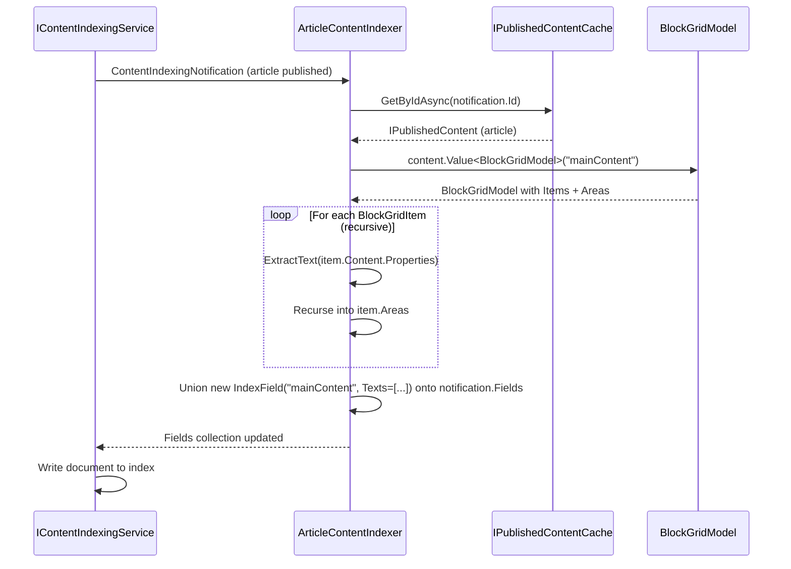

# Umbraco Search Q&A

A running record of questions and answers about the new Umbraco Search API (`Umbraco.Cms.Search`), introduced in Umbraco 17.

---

## What is `Umbraco.Cms.Search` and when was it introduced?

It is a provider-agnostic search abstraction layer introduced in **Umbraco 17**. It sits on top of whichever search backend you choose — Lucene (via Examine) or Elasticsearch — and exposes a single consistent API regardless of the underlying provider. The core package is `Umbraco.Cms.Search.Core` (1.0.0-beta.2 at the time of this demo).

---

## What NuGet packages do I need?

| Package | Purpose |
|---------|---------|
| `Umbraco.Cms.Search.Core` | Core abstractions — always required |
| `Umbraco.Cms.Search.Provider.Examine` | Lucene/Examine (on-disk) provider |
| `Umbraco.Cms.Search.BackOffice` | Replaces the back-office global search bar with the new Search API (optional) |
| `Kjac.SearchProvider.Elasticsearch` | Community Elasticsearch provider (optional) |

---

## What is the main advantage of the new API over classic Examine?

The key advantages are:

- **Provider abstraction** — swapping from Examine to Elasticsearch is a single line change in DI registration; your controllers and indexers stay identical.
- **Built-in faceting** — `KeywordFacet`, `IntegerRangeFacet`, and `DateTimeOffsetRangeFacet` are first-class concepts, not workarounds.
- **Typed filtering and sorting** — `KeywordFilter`, `IntegerRangeFilter`, `DecimalSorter`, etc. replace raw Lucene query strings.
- **Non-Umbraco data** — custom data (e.g. people from a JSON file) is a first-class use case via `IElasticsearchIndexer`.

---

## How do I register the search system in my Composer?

Call `AddSearchCore()` first, then chain on whichever providers you need:

```csharp
builder
    .AddSearchCore()
    .AddElasticsearchSearchProvider()   // optional
    .AddExamineSearchProvider();        // optional
```

Both providers can be registered simultaneously. Each index is independently associated with a specific provider at registration time.

---

## How do I register an index?

Use `IndexOptions` in DI. For an Elasticsearch content index:

```csharp
builder.Services.Configure<IndexOptions>(options =>
    options.RegisterElasticsearchContentIndex<IPublishedContentChangeStrategy>(
        "MyIndexAlias",
        UmbracoObjectTypes.Document
    )
);
```

For an Examine content index with a custom change strategy:

```csharp
builder.Services.Configure<IndexOptions>(options =>
    options.RegisterContentIndex<IIndexer, ISearcher, MyChangeStrategy>(
        SearchConstants.IndexAliases.PublishedContent,
        UmbracoObjectTypes.Document
    )
);
builder.Services.AddSingleton<MyChangeStrategy>();
```

> Re-registering an alias replaces the previous registration. You must also register the concrete strategy class separately in DI, or you will get a runtime exception.

---

## What are the two ways to add custom fields to a content index?

| Approach | Interface | When it fires | Best for |
|----------|-----------|---------------|----------|
| `IContentIndexer` | `IContentIndexer` | During field assembly | Service-injected, synchronous enrichment |
| Notification | `INotificationAsyncHandler<ContentIndexingNotification>` | Just before writing to the index | Async, access to published content model, cross-cutting |

Both can coexist. The pipeline runs all `IContentIndexer` implementations first, then fires the notification.

---

## How does `IContentIndexer` work?

Implement the interface and register it as **transient**. It receives the full `IContentBase` object:

```csharp
public class MyContentIndexer : IContentIndexer
{
    public Task<IEnumerable<IndexField>> GetIndexFieldsAsync(
        IContentBase content, string?[] cultures, bool published, CancellationToken ct)
    {
        if (content.ContentType.Alias is not "recipe")
            return Task.FromResult(Enumerable.Empty<IndexField>());

        return Task.FromResult<IEnumerable<IndexField>>([
            new IndexField("rating", new IndexValue { Decimals = [4.5m] }, null, null)
        ]);
    }
}
```

```csharp
builder.Services.AddTransient<IContentIndexer, MyContentIndexer>();
```

Multiple `IContentIndexer` implementations can be registered — all are called and their fields merged.

---

## What is the difference between `Keywords` and `Texts` in `IndexValue`?

| Type | Analysed? | Use for |
|------|-----------|---------|
| `Keywords` | No — stored as-is | Exact-match filtering, faceting, sorting |
| `Texts` | Yes — tokenised and stemmed | Full-text search |

A single field can carry **both**, which allows both exact-match faceting and full-text search on the same field. For example, `genre = "Jazz"` stored as both `Keywords` and `Texts` means a query for "jaz" still matches via stemming, and the facet can still group by the exact value "Jazz".

---

## How do I search an index?

Inject `ISearcherResolver`, get a searcher, and call `SearchAsync`:

```csharp
var searcher = _searcherResolver.GetRequiredSearcher(indexAlias);

var result = await searcher.SearchAsync(
    indexAlias: indexAlias,
    query:      "pasta",
    filters:    [new KeywordFilter("cuisine", ["Italian"], false)],
    facets:     [new KeywordFacet("cuisine"), new IntegerRangeFacet("preparationTime", ranges)],
    sorters:    [new DecimalSorter("rating", Direction.Descending)],
    skip:       0,
    take:       10
);
```

The result contains `result.Total`, `result.Documents` (with `.Id` per document), and `result.Facets`.

---

## What filter types are available?

| Filter class | Field type | Example |
|-------------|-----------|---------|
| `KeywordFilter` | Keywords | `cuisine == "Italian"` |
| `IntegerRangeFilter` | Integers | `preparationTime` between 15 and 30 |
| `DateTimeOffsetRangeFilter` | DateTimeOffsets | `birthdate` within a year range |

Multiple filters are combined with AND logic. Multiple values within a single filter use OR logic. The third constructor argument is a `negate` flag — set to `true` to exclude matching documents.

---

## What sorter types are available?

| Sorter class | Field type |
|-------------|-----------|
| `ScoreSorter` | Relevance score |
| `TextSorter` | Analysed text (alphabetical) |
| `KeywordSorter` | Exact keyword (alphabetical) |
| `IntegerSorter` | Integer |
| `DecimalSorter` | Decimal |
| `DateTimeOffsetSorter` | Date/time |

> For Examine, any field used for sorting must be declared in `FieldOptions` with `Sortable = true`, or Examine silently falls back to relevance ordering.

---

## What is the two-phase result pattern and why use it?

After searching, you get back only document IDs (not the full content). You then fetch full content from the Umbraco published content cache:

```csharp
// phase 1 — search
var result = await searcher.SearchAsync(/* ... */);
var ids = result.Documents.Select(d => d.Id);

// phase 2 — hydrate
var content = await _publishedContentCache.GetByIdsAsync(ids);
```

This keeps the search index lean — you only store fields needed for filtering, faceting, and sorting. Rich content (teaser text, URLs, images) is fetched from Umbraco's optimised cache.

> **Note:** `GetByIdsAsync` returns results in an unspecified order. If result ranking matters, re-sort the hydrated collection to match the original ID order from the search result.

---

## How do I index data that has no connection to Umbraco content?

Use `IElasticsearchIndexer` directly. Map your data model to `IndexField` arrays and call `AddOrUpdateAsync`:

```csharp
await _indexer.ResetAsync(indexAlias);  // clear existing index

await _indexer.AddOrUpdateAsync(
    indexAlias,
    person.Id,                       // Guid document ID
    UmbracoObjectTypes.Unknown,      // use Unknown for non-Umbraco data
    [new Variation(null, null)],     // culture-invariant
    GetIndexFields(person),          // your IndexField array
    null                             // no parent
);
```

There is no Examine equivalent for fully custom non-content indexes at this time — this is Elasticsearch-only.

---

## What is a content change strategy and when do I need one?

A content change strategy (`IContentChangeStrategy`) controls which documents get re-indexed when a content change event fires. The **default** strategy re-indexes only the document that was published.

You need a custom strategy when:
- You need to re-index **related or linked documents** (e.g. a document stores a denormalized field from another document)
- You need to re-index ancestor or descendant documents
- You want to **exclude** certain documents from indexing

You do **not** need a custom strategy just to add extra fields to the same document — use `IContentIndexer` or `ContentIndexingNotification` for that.

---

## How does the related recipe re-indexing strategy work?

When Recipe A is published, `RelatedRecipePublishedContentChangeStrategy`:

1. Finds all documents that reference Recipe A (via `ITrackedReferencesService.GetPagedRelationsForItemAsync`)
2. Adds `ContentChange.Document(id, ChangeImpact.Refresh, ContentState.Published)` entries for each related document
3. Delegates the merged set of changes to the core `IPublishedContentChangeStrategy`

This ensures that Recipe B's index entry (which contains Recipe A's name as `relatedRecipeName`) is refreshed automatically when Recipe A is renamed.

> The demo hardcodes a limit of 1,000 relations per page. In production, loop through all pages if you could have more than 1,000 references to a single document.

---

## How do I update the index without publishing content?

Use `IDistributedContentIndexRefresher.RefreshContent`:

```csharp
_distributedContentIndexRefresher.RefreshContent([content], ContentState.Published);
```

This triggers a re-index of the specified documents without a publish event. The call is fire-and-forget — the HTTP response is returned immediately and the index update happens asynchronously.

> In production, avoid calling this once per user action if many actions can happen in a short window. Use a debounce/batching pattern to coalesce multiple updates into a single reindex per time window.

---

## What are the Examine-specific gotchas I need to know about?

**1. Declare fields for faceting and sorting**

Elasticsearch infers field types; Examine does not. Without explicit `FieldOptions` configuration, facets return empty results and sorting silently falls back to relevance. You do **not** need to declare fields used only for filtering.

```csharp
builder.Services.Configure<FieldOptions>(options => options.Fields =
[
    new() { PropertyName = "cuisine", FieldValues = FieldValues.Keywords, Facetable = true, Sortable = true },
    new() { PropertyName = "rating",  FieldValues = FieldValues.Decimals,  Facetable = false, Sortable = true },
]);
```

**2. `ExpandFacetValues` has a performance cost**

By default in Examine, selecting a facet value collapses the facet group to show only the active value. Setting `ExpandFacetValues = true` shows all values even when one is active — which is usually what users expect — but incurs a performance penalty. Benchmark on large indexes before enabling globally.

**3. `FieldOptions` is global**

There is no per-index `FieldOptions`. All Examine-backed indexes share one configuration — declare all custom fields from all indexes in the same array.

**4. `FieldValues` must match `IndexValue` types**

If you declare a field as `FieldValues.Keywords` but write it with `IndexValue { Texts = [...] }`, facet and sort results will be wrong or empty. Always match the declaration to the value type you actually write.

---

## How do I index a Block Grid property (e.g. `mainContent` on an article document type)?

Block Grid values need to be read from the **published content model** (`IPublishedContent`) to be parsed into a `BlockGridModel`. That means the `ContentIndexingNotification` approach is the right choice here — `IContentIndexer` only gives you `IContentBase`, which holds the raw unpublished property value as JSON rather than a usable model.

### The approach



1. Handle `ContentIndexingNotification`
2. Fetch the published content via `IPublishedContentCache`
3. Read the property as `BlockGridModel`
4. Walk all blocks (and their areas) recursively to extract text
5. Write the combined text as a `Texts` field so it is full-text searchable

### Example implementation

```csharp
public class ArticleContentIndexer : INotificationAsyncHandler<ContentIndexingNotification>
{
    private readonly IPublishedContentCache _publishedContentCache;

    public ArticleContentIndexer(IPublishedContentCache publishedContentCache)
        => _publishedContentCache = publishedContentCache;

    public async Task HandleAsync(ContentIndexingNotification notification, CancellationToken ct)
    {
        // only handle the relevant index(es)
        if (notification.IndexAlias is not SearchConstants.IndexAliases.PublishedContent)
            return;

        var content = await _publishedContentCache.GetByIdAsync(notification.Id);
        if (content?.ContentType.Alias != "article")
            return;

        var blockGrid = content.Value<BlockGridModel>("mainContent");
        if (blockGrid is null)
            return;

        var texts = ExtractText(blockGrid.Items).ToArray();
        if (texts.Length == 0)
            return;

        notification.Fields = notification.Fields
            .Union([
                new IndexField(
                    FieldName: "mainContent",
                    Value: new IndexValue { Texts = texts },
                    Culture: null,
                    Segment: null
                )
            ])
            .ToArray();
    }

    private static IEnumerable<string> ExtractText(IEnumerable<BlockGridItem> items)
    {
        foreach (var item in items)
        {
            // extract text from each property on the block's content element
            foreach (var property in item.Content.Properties)
            {
                var value = item.Content.Value<string>(property.Alias);
                if (!string.IsNullOrWhiteSpace(value))
                    yield return value;
            }

            // recurse into grid areas (columns / zones)
            foreach (var area in item.Areas)
            foreach (var text in ExtractText(area.Items))
                yield return text;
        }
    }
}
```

### Registration

```csharp
builder.AddNotificationAsyncHandler<ContentIndexingNotification, ArticleContentIndexer>();
```

### Things to watch out for

**Rich text blocks produce HTML.** If any of your blocks contain a Rich Text Editor property, `Value<string>()` will return raw HTML including tags like `<p>`, `<strong>`, etc. Strip the HTML before indexing so tags don't pollute search results:

```csharp
var value = item.Content.Value<string>(property.Alias);
if (!string.IsNullOrWhiteSpace(value))
{
    var text = Regex.Replace(value, "<[^>]+>", " ").Trim();
    if (!string.IsNullOrWhiteSpace(text))
        yield return text;
}
```

**Not all properties are text.** Iterating over every property and calling `Value<string>()` will return `null` for non-text properties (media pickers, content pickers, checkboxes, etc.) — safely skipped by the `IsNullOrWhiteSpace` guard. If you want to be more selective, guard on `item.Content.ContentType.Alias` or `property.Alias`.

**Culture-variant content.** If your site is multilingual, loop over the cultures provided by the notification and create a separate `IndexField` per culture, passing the culture string instead of `null` for the `Culture` parameter.

---

## What indexes does the Examine provider register, and what fields do they contain by default?

### The four indexes

Calling `AddExamineSearchProvider()` registers four Lucene indexes:

| Alias constant | Actual alias string | Object type | Change strategy |
|---|---|---|---|
| `Constants.IndexAliases.DraftContent` | `Umb_Content` | Document | `IDraftContentChangeStrategy` |
| `Constants.IndexAliases.PublishedContent` | `Umb_PublishedContent` | Document | `IPublishedContentChangeStrategy` |
| `Constants.IndexAliases.DraftMedia` | `Umb_Media` | Media | `IDraftContentChangeStrategy` |
| `Constants.IndexAliases.DraftMembers` | `Umb_Members` | Member | `IDraftContentChangeStrategy` |

> Note: these alias strings are different from classic Examine (`InternalIndex`, `ExternalIndex`, etc.). Any code that hard-codes the old names will break.

---

### System fields (every document gets these)

The internal `SystemFieldsContentIndexer` writes the following fields on every indexed item. All field names are defined in `Constants.FieldNames` and are prefixed `Umb_`:

| Field name | Type | Contains |
|---|---|---|
| `Umb_Id` | Keyword | The content `Key` (Guid) |
| `Umb_ParentId` | Keyword | Parent `Key` (Guid); `Guid.Empty` for root items; recycle bin key if trashed |
| `Umb_PathIds` | Keywords (multi-value) | All ancestor keys + the item's own key — the full path as Guids |
| `Umb_ContentTypeId` | Keyword | The content type's `Key` (Guid) |
| `Umb_CreateDate` | DateTimeOffset | Creation date |
| `Umb_UpdateDate` | DateTimeOffset | Last updated date |
| `Umb_Level` | Integer | Depth in the content tree |
| `Umb_SortOrder` | Integer | Sort order among siblings |
| `Umb_ObjectType` | Keyword | `"Document"`, `"Media"`, or `"Member"` |
| `Umb_Name` | TextsR1 (per culture) | Content name — indexed as highest-rank full-text so it scores higher in relevance |
| `Umb_Tags` | Keywords (per culture) | Any Umbraco tags assigned to the item |

> **All IDs are stored as Guids (Keywords), not integers.** Classic Examine stored `parentID` as an integer. The new system uses Guid keys throughout, so filters on these fields must use Guid strings.

---

### Property value fields

The internal `PropertyValueFieldsContentIndexer` then iterates every property on the content item and adds its value using the matching `IPropertyValueHandler` for that property editor. The built-in handlers cover:

- Plain strings, keyword strings, rich text, markdown, labels
- Integers, decimals, booleans, date/times
- Block List, Block Grid, Block Editor
- Content picker, multi-node tree picker, multi-URL picker
- Tags

**Sensitive member properties are automatically excluded** — the indexer checks `IMemberType.IsSensitiveProperty()` and skips those fields entirely.

If no handler is registered for a property editor alias, a debug log message is written and the property is skipped silently.

---

### The `DisableDefaultExamineIndexes()` escape hatch

If the new search stack is powering everything (front-end search, back-office search, and the Delivery API), you can stop Umbraco maintaining its own legacy Examine indexes by calling:

```csharp
builder.DisableDefaultExamineIndexes();
```

This replaces `IExamineManager` with `MaskedCoreIndexesExamineManager`, which hides the old built-in indexes from Examine's index list. Only do this when you are certain nothing else depends on the classic indexes.

---

## How can I see what the index looks like so I can check the indexed values?

There are several ways, depending on which provider you are using.

---

### Option 1 — Examine Management dashboard (Examine provider)

The classic **Examine Management** dashboard is available under **Settings → Examine Management** and is the quickest way to inspect what is actually in a Lucene index. It lets you:
- List all registered indexes
- Run ad-hoc queries against an index
- Click through to individual documents and see every stored field and its value

This works without any extra packages — it ships with Umbraco.

---

### Option 2 — Elasticsearch REST API (Elasticsearch provider)

Because Elasticsearch exposes an HTTP API, you can query it directly from any HTTP client (curl, Postman, the browser, etc.).

**List all indexes:**
```
GET http://localhost:9200/_cat/indices?v
```

**See the field mappings for an index (what fields exist and their types):**
```
GET http://localhost:9200/customindexelasticsearch/_mapping
```

**Fetch the first 10 documents to inspect their stored fields:**
```
GET http://localhost:9200/customindexelasticsearch/_search
{
  "size": 10,
  "query": { "match_all": {} }
}
```

**Find a specific document by its Umbraco `Key` (Guid):**
```
GET http://localhost:9200/customindexelasticsearch/_search
{
  "query": {
    "term": { "id": "9622bf04-83a8-44e1-9535-bdcc3b6066eb" }
  }
}
```

The index alias used in the URL is the lowercase version of the alias registered in code (Elasticsearch lowercases index names). Check `SiteConstants.IndexAliases` in the project for the exact strings.

> Enable `"EnableDebugMode": true` in `appsettings.Development.json` to log the full Elasticsearch request and response payloads to the application log — invaluable when verifying what is actually being sent and stored.

---

### Option 3 — Kibana Dev Tools (Elasticsearch provider)

If you have Kibana running alongside Elasticsearch, the **Dev Tools** console (at `http://localhost:5601/app/dev_tools`) gives you an interactive query editor with autocomplete. Paste the same queries from Option 2 directly into the console.

Kibana's **Discover** view also lets you browse index documents visually and filter by field values, which is useful for confirming that a field like `mainContent` contains the text you expect.

---

### Option 4 — Luke (Examine / Lucene provider)

[Luke](https://github.com/apache/lucene/releases) is a standalone desktop tool for inspecting Lucene indexes on disk.

**Where the Examine index files live:**
```
/umbraco/Data/TEMP/ExamineIndexes/<IndexName>/
```

```
umbraco/
└── Data/
    └── TEMP/
        └── ExamineIndexes/
            ├── PublishedContent/    ← default content index
            └── ...
```

Open Luke, point it at the index folder, and you can:
- Browse every document stored in the index
- See all field names and their raw stored values
- Run Lucene query syntax directly against the index

> **Important:** Stop or detach the running Umbraco application before opening the index in Luke, or use Luke's read-only mode. Lucene locks its index files while a process has them open — opening with two writers simultaneously will corrupt the index.

---

### Quick decision guide

```
Which provider am I using?
│
├── Examine (Lucene)
│   ├── App is running  →  Umbraco back-office Examine Management
│   └── App is stopped  →  Luke (desktop tool, open index folder directly)
│
└── Elasticsearch
    ├── Just checking fields/mappings  →  REST API (_mapping endpoint)
    ├── Browsing documents             →  Kibana Discover / Dev Tools
    └── Debugging query shapes         →  EnableDebugMode in appsettings
```

---
